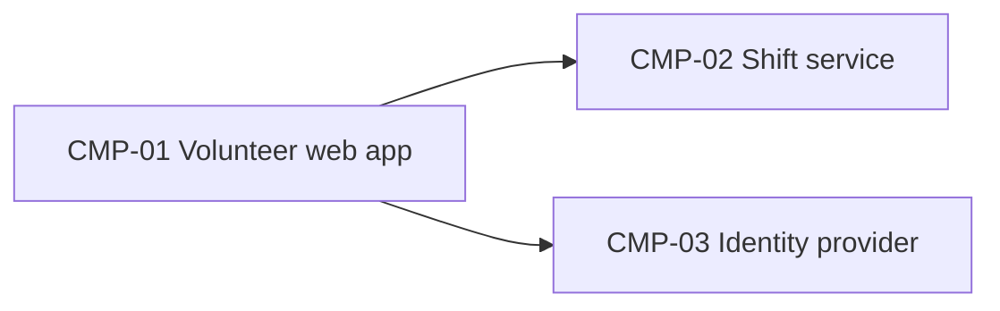

# ARCH-001 — Riverside Food Bank volunteer shift sign-up architecture

## 1. Context and scope

Defined against PRD-001 version 1 (approved): volunteers sign in and book warehouse shifts. Payroll and donations are outside the system. No inspection scope was named, and no code was inspected. The user explicitly requested amendment of ARCH-001 for PRD-001 and confirmed the amend outcome in this session; no additional decision questions were authorized. The PRD remains at version 1. This amendment checks the existing resolvers against their current ADR status.

## 2. Quality drivers

PRD-001#NFR-001 (phone numbers visible only to the coordinator) drives data ownership. The internal operating context requires constraint, security and privacy coverage. Privacy is covered by PRD-001#NFR-001; explicit security and constraint NFR coverage is absent and remains a PRD-owner clarification, not an architectural decision.

## 3. Components

Existing component items are preserved as the historical baseline. ARCH-001#CMP-03 still quotes ADR-002, which is now superseded; its on-premises deployment is no longer a valid decision. ADR-003 records retirement of that server and hosting-provider deployment, but explicitly does not select a replacement identity provider. ARCH-001#DEC-01 is open pending that choice. The diagram describes logical responsibilities, not a confirmed replacement platform.



```yaml items
components:
  - id: CMP-01
    status: active
    name: "Volunteer web app"
    responsibility: "Sign-in and booking screens; holds no data of its own"
    owns_data: []
    interacts_with:
      - "CMP-02"
      - "CMP-03"
    deployment: "Static site on the hosting provider"
  - id: CMP-02
    status: active
    name: "Shift service"
    responsibility: "Shifts, bookings and volunteer contact details"
    owns_data:
      - "Shifts and bookings"
      - "Volunteer phone numbers"
    interacts_with:
      - "CMP-01"
    deployment: "One hosted service with its database"
    upstream:
      - {id: PRD-001, item: NFR-001, relation: informed_by, version: 1, hash: null}
  - id: CMP-03
    status: active
    name: "Identity provider"
    responsibility: "Authenticates volunteers and issues sessions"
    owns_data:
      - "Volunteer credentials"
    interacts_with:
      - "CMP-01"
    deployment: "Keycloak on the food bank's on-premises server (ADR-002)"
```

## 4. Architectural questions

ARCH-001#DEC-01 is reopened because ADR-002 is superseded. ADR-003 answers a hosting question, not the identity-provider question, and cannot resolve it. ARCH-001#DEC-02 retains its existing resolution by the accepted, non-superseded ADR-001. Confirming amendment accepts no new architectural decision.

```yaml items
decisions:
  - id: DEC-01
    status: active
    question: "Which identity provider handles volunteer sign-in?"
    blocking: true
    state: open
    resolved_by: []
    notes: null
    upstream:
      - {id: PRD-001, item: FR-001, relation: informed_by, version: 1, hash: null}
  - id: DEC-02
    status: active
    question: "Where are shift, booking and contact data stored, and which component owns them?"
    blocking: true
    state: resolved
    resolved_by: [ADR-001]
    notes: null
    upstream:
      - {id: PRD-001, item: FR-002, relation: informed_by, version: 1, hash: null}
      - {id: PRD-001, item: NFR-001, relation: informed_by, version: 1, hash: null}
```

## 5. Evidence inspected

ARCH-001#EVD-03 is preserved as historical evidence. ARCH-001#EVD-04 records ADR-002's current superseded status; the earlier acceptance is not a current resolver.

```yaml items
evidence:
  - id: EVD-01
    status: active
    source: "PRD-001"
    kind: prd
    finding: "Version 1, status approved: sign-in (FR-001), booking (FR-002) and private phone numbers (NFR-001)."
    classification: context
  - id: EVD-02
    status: active
    source: "ADR-001"
    kind: adr
    finding: "Version 1, status accepted: the shift service owns shift, booking and contact data in one managed PostgreSQL database."
    classification: decided
  - id: EVD-03
    status: active
    source: "ADR-002"
    kind: adr
    finding: "Version 1, status accepted: Keycloak on the on-premises server handles volunteer sign-in."
    classification: decided
  - id: EVD-04
    status: active
    source: "ADR-002"
    kind: adr
    finding: "Version 1, status superseded (superseded_by ADR-003): the on-premises Keycloak decision no longer resolves DEC-01."
    classification: context
  - id: EVD-05
    status: active
    source: "ADR-003"
    kind: adr
    finding: "Version 1, status accepted (superseded_by null): retires the on-premises server and places every service on the hosting provider; explicitly leaves the replacement identity provider undecided. It does not answer DEC-01."
    classification: decided
```

## 6. Deployment

The historical baseline places the web app and shift service on the hosting provider. ADR-001 still establishes one managed PostgreSQL database owned by the shift service. ADR-003 records that all services must run on the hosting provider because the on-premises server is being removed at the end of October. The former Keycloak deployment in ARCH-001#CMP-03 is therefore historical, not a current deployment commitment. The replacement identity provider remains open in ARCH-001#DEC-01. These are document findings; deployment has not been verified against code or infrastructure.

## 7. Requirement changes proposed to the PRD owner

- None.

## 8. Open questions

- [NEEDS CLARIFICATION: amendment validation failed because the exact host model ID is unavailable. ERR-05 restored the original status and approval fields; those historical values do not approve this version 2 amendment. No validated readiness handoff is issued.]

- [NEEDS CLARIFICATION: host model/session identity unavailable] The actual session ID is recorded; the exact host model ID is unavailable, so provenance validation remains unresolved.
- [NEEDS CLARIFICATION: no inspection scope was named and no code or configuration was inspected; implementation and deployment conformity are unknown.]
- [NEEDS CLARIFICATION: Priya Nair must clarify security and constraint coverage for PRD-001's internal operating context; neither category has an explicit NFR.]
- [NEEDS CLARIFICATION: the replacement identity provider remains undecided in ARCH-001#DEC-01; ADR-003 settles hosting only.]

## Change Log

| Version | Date | Author | Change | Items affected |
|---|---|---|---|---|
| 1 | 2026-09-21 | claude-code (session fixture-session) | Initial draft for PRD-001 v1. Policy resolution: interview.max_calls=8 (default); architecture.mandated_platforms=none (default); quality.required_categories=floor only (default) | all |
| 1 | 2026-09-22 | Priya Nair | Approved | status |
| 2 | 2026-09-28 | codex (session 01a0ea0f-11d0-77d3-8cd7-786c7c201800) | Amend outcome confirmed in the request. DEC-01 resolved → open: ADR-002 superseded by ADR-003, whose hosting decision does not choose an identity provider. DEC-02 remains resolved by ADR-001. Preserve existing items; append current ADR evidence and clarify deployment, quality gaps and incomplete model provenance. Policy resolution: interview.max_calls=8 (default); architecture.mandated_platforms=none (default); quality.required_categories=floor only (default) | DEC-01, EVD-04, EVD-05, metadata and prose |
| 2 | 2026-09-28 | codex (session 01a0ea0f-11d0-77d3-8cd7-786c7c201800) | ERR-05: validation remains unresolved after three checks because the exact host model ID is unavailable (self-check 3; BEH-13/VER-14). Restored status to approved, approved_by to Priya Nair and approved_on to 2026-09-22, their pre-write values; this restoration is not approval of the amendment. Retained the DEC-01 reopening and new evidence; no ADR changed. Readiness handoff withheld. Policy resolution: interview.max_calls=8 (default); architecture.mandated_platforms=none (default); quality.required_categories=floor only (default) | status, approved_by, approved_on; validation audit |
