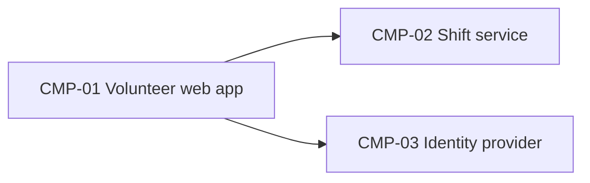

# ARCH-001 — Riverside Food Bank volunteer shift sign-up architecture

## 1. Context and scope

Defined against PRD-001 version 1 (approved): volunteers sign in and book warehouse shifts. Payroll and donations are outside the system. No inspection scope was named, and no code was inspected.

## 2. Quality drivers

PRD-001#NFR-001 (phone numbers visible only to the coordinator) drives data ownership and authorization. The internal operating context requires constraint, security and privacy coverage. Privacy is covered; constraint and security have no explicit NFRs. These product gaps remain for Priya Nair to clarify, without inventing requirements.

## 3. Components

Existing component items are preserved as historical baseline records. ARCH-001#CMP-03 deployment refers to superseded ADR-002 and is no longer a valid deployment commitment. The provider remains open under ARCH-001#DEC-01. ADR-003 records the hosting direction, but selects no replacement identity provider.



```yaml items
components:
  - id: CMP-01
    status: active
    name: "Volunteer web app"
    responsibility: "Sign-in and booking screens; holds no data of its own"
    owns_data: []
    interacts_with:
      - "CMP-02"
      - "CMP-03"
    deployment: "Static site on the hosting provider"
  - id: CMP-02
    status: active
    name: "Shift service"
    responsibility: "Shifts, bookings and volunteer contact details"
    owns_data:
      - "Shifts and bookings"
      - "Volunteer phone numbers"
    interacts_with:
      - "CMP-01"
    deployment: "One hosted service with its database"
    upstream:
      - {id: PRD-001, item: NFR-001, relation: informed_by, version: 1, hash: null}
  - id: CMP-03
    status: active
    name: "Identity provider"
    responsibility: "Authenticates volunteers and issues sessions"
    owns_data:
      - "Volunteer credentials"
    interacts_with:
      - "CMP-01"
    deployment: "Keycloak on the food bank's on-premises server (ADR-002)"
```

## 4. Architectural questions

ARCH-001#DEC-01 is reopened because ADR-002 is superseded. ADR-003 explicitly answers a different question (hosting). ARCH-001#DEC-02 retains ADR-001, which remains accepted and has no successor. Confirming amendment does not resolve the remaining questions.

```yaml items
decisions:
  - id: DEC-01
    status: active
    question: "Which identity provider handles volunteer sign-in?"
    blocking: true
    state: open
    resolved_by: []
    notes: null
    upstream:
      - {id: PRD-001, item: FR-001, relation: informed_by, version: 1, hash: null}
  - id: DEC-02
    status: active
    question: "Where are shift, booking and contact data stored, and which component owns them?"
    blocking: true
    state: resolved
    resolved_by: [ADR-001]
    notes: null
    upstream:
      - {id: PRD-001, item: FR-002, relation: informed_by, version: 1, hash: null}
      - {id: PRD-001, item: NFR-001, relation: informed_by, version: 1, hash: null}
  - id: DEC-03
    status: active
    question: "How is coordinator-only access to volunteer phone numbers enforced by the shift service?"
    blocking: true
    state: open
    resolved_by: []
    notes: "ADR-001 establishes data ownership and a single API boundary, but does not specify the shared authorization approach. No decision was requested or supplied in this amendment."
    upstream:
      - {id: PRD-001, item: NFR-001, relation: informed_by, version: 1, hash: null}
  - id: DEC-04
    status: active
    question: "How does authenticated volunteer identity pass from the web app to the shift service for booking?"
    blocking: true
    state: open
    resolved_by: []
    notes: "The shared authentication interface between components remains unspecified; no provider or session protocol is selected by this amendment."
    upstream:
      - {id: PRD-001, item: FR-001, relation: informed_by, version: 1, hash: null}
      - {id: PRD-001, item: FR-002, relation: informed_by, version: 1, hash: null}
```

## 5. Evidence inspected

```yaml items
evidence:
  - id: EVD-01
    status: active
    source: "PRD-001"
    kind: prd
    finding: "Version 1, status approved: sign-in (FR-001), booking (FR-002) and private phone numbers (NFR-001)."
    classification: context
  - id: EVD-02
    status: active
    source: "ADR-001"
    kind: adr
    finding: "Version 1, status accepted: the shift service owns shift, booking and contact data in one managed PostgreSQL database."
    classification: decided
  - id: EVD-03
    status: active
    source: "ADR-002"
    kind: adr
    finding: "Version 1, status accepted: Keycloak on the on-premises server handles volunteer sign-in."
    classification: decided
  - id: EVD-04
    status: active
    source: "ADR-002"
    kind: adr
    finding: "Version 1, status superseded (superseded_by ADR-003): the former on-premises Keycloak decision no longer resolves DEC-01. EVD-03 is retained as historical evidence."
    classification: context
  - id: EVD-05
    status: active
    source: "ADR-003"
    kind: adr
    finding: "Version 1, status accepted (superseded_by null): retire the on-premises server and run every service on the hosting provider. This is a hosting-only decision; the replacement identity provider has not been decided."
    classification: decided
```

## 6. Deployment

ADR-003 records the accepted hosting direction: retire the on-premises server and run every service on the hosting provider. The historical on-premises placement in ARCH-001#CMP-03 is invalidated by ADR-002 supersession. The identity provider remains undecided (ARCH-001#DEC-01). ADR-001 continues to place shift, booking and contact data in a managed PostgreSQL database owned by the shift service. Actual deployment and implementation have not been inspected.

## 7. Requirement changes proposed to the PRD owner

- None.

## 8. Open questions

- [NEEDS CLARIFICATION: ARCH-001#DEC-01 needs an identity-provider decision; ADR-003 does not answer that question.]
- [NEEDS CLARIFICATION: ARCH-001#DEC-03 needs a shared authorization approach for coordinator-only phone access.]
- [NEEDS CLARIFICATION: ARCH-001#DEC-04 needs an authentication interface between the web app and shift service.]
- [NEEDS CLARIFICATION: No inspection scope was named and no code was inspected; implementation and deployment conformance are unknown.]
- [NEEDS CLARIFICATION: Priya Nair should clarify security and constraint quality coverage for the internal operating context; PRD-001 has no explicit NFRs in these required categories.]
- [NEEDS CLARIFICATION: host model/session identity unavailable]

The host exposes session identity, but no exact model ID. Model provenance remains unknown and validation failed (ERR-05). The pre-amendment status and approval fields were restored under the failure rule; they record historical approval only and do not approve version 2. This amendment has no validated readiness handoff.

## Change Log

| Version | Date | Author | Change | Items affected |
|---|---|---|---|---|
| 1 | 2026-09-21 | claude-code (session fixture-session) | Initial draft for PRD-001 v1. Policy resolution: interview.max_calls=8 (default); architecture.mandated_platforms=none (default); quality.required_categories=floor only (default) | all |
| 1 | 2026-09-22 | Priya Nair | Approved | status |
| 2 | 2026-09-28 | codex (session 01a0ea20-a9c9-7640-8851-c80038a5c1af) | Amendment confirmed in the user request for PRD-001 v1. DEC-01 resolved → open: ADR-002 superseded by ADR-003, which settles hosting only. Preserved DEC-02 and all existing component and evidence items; added current ADR evidence and open authorization and authentication-interface questions; corrected deployment prose and recorded quality and provenance gaps. Policy resolution: interview.max_calls=8 (default); architecture.mandated_platforms=none (default); quality.required_categories=floor only (default) | DEC-01, DEC-03, DEC-04, EVD-04, EVD-05; metadata and sections 2, 3, 4, 6, 8 |
| 2 | 2026-09-28 | codex (session 01a0ea20-a9c9-7640-8851-c80038a5c1af) | ERR-05: validation failed because exact host model identity is unavailable (self-check 3; BEH-13/VER-14). Restored pre-write status approved, approved_by Priya Nair and approved_on 2026-09-22; these historical fields do not approve the amendment. Retained amendment content; readiness handoff withheld. Policy resolution: interview.max_calls=8 (default); architecture.mandated_platforms=none (default); quality.required_categories=floor only (default) | status, approved_by, approved_on; validation audit |
