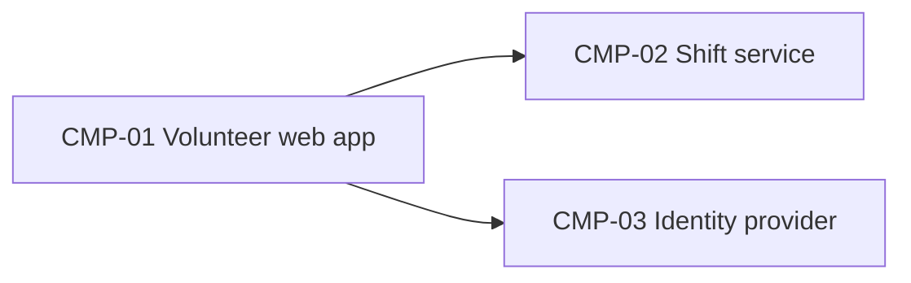

# ARCH-001 — Riverside Food Bank volunteer shift sign-up architecture

## 1. Context and scope

Defined against PRD-001 version 1 (approved): volunteers sign in and book warehouse shifts. Payroll and donations are outside the system. No inspection scope was named, and no code was inspected. The user explicitly selected PRD-001 and confirmed amend ARCH-001 in the request, directing that no further questions be asked. This amendment rechecks the existing decisions against current ADR status; it accepts no new architectural decision. Validation failed (ERR-05): exact host model provenance is unavailable. The prior status and approval fields were restored under the validation-failure rule; they are historical approval metadata, not approval of this version 2 amendment. Readiness handoff is withheld.

## 2. Quality drivers

PRD-001#NFR-001 (phone numbers visible only to the coordinator) drives data ownership. The operating context is internal; its required quality categories are constraint, security and privacy. Privacy is covered by PRD-001#NFR-001; security and constraint have no explicit NFR coverage and remain PRD-owner clarification gaps. No approved policy documents or local preferences were present.

## 3. Components

Existing component items are preserved for traceability. ARCH-001#CMP-03 records the former Keycloak deployment from ADR-002; that deployment is historical, because ADR-002 is now superseded. The identity-provider role remains in the overview, but its implementation is open under ARCH-001#DEC-01. ADR-003 records the hosting direction without choosing a replacement identity provider.



```yaml items
components:
  - id: CMP-01
    status: active
    name: "Volunteer web app"
    responsibility: "Sign-in and booking screens; holds no data of its own"
    owns_data: []
    interacts_with:
      - "CMP-02"
      - "CMP-03"
    deployment: "Static site on the hosting provider"
  - id: CMP-02
    status: active
    name: "Shift service"
    responsibility: "Shifts, bookings and volunteer contact details"
    owns_data:
      - "Shifts and bookings"
      - "Volunteer phone numbers"
    interacts_with:
      - "CMP-01"
    deployment: "One hosted service with its database"
    upstream:
      - {id: PRD-001, item: NFR-001, relation: informed_by, version: 1, hash: null}
  - id: CMP-03
    status: active
    name: "Identity provider"
    responsibility: "Authenticates volunteers and issues sessions"
    owns_data:
      - "Volunteer credentials"
    interacts_with:
      - "CMP-01"
    deployment: "Keycloak on the food bank's on-premises server (ADR-002)"
```

## 4. Architectural questions

```yaml items
decisions:
  - id: DEC-01
    status: active
    question: "Which identity provider handles volunteer sign-in?"
    blocking: true
    state: open
    resolved_by: []
    notes: null
    upstream:
      - {id: PRD-001, item: FR-001, relation: informed_by, version: 1, hash: null}
  - id: DEC-02
    status: active
    question: "Where are shift, booking and contact data stored, and which component owns them?"
    blocking: true
    state: resolved
    resolved_by: [ADR-001]
    notes: null
    upstream:
      - {id: PRD-001, item: FR-002, relation: informed_by, version: 1, hash: null}
      - {id: PRD-001, item: NFR-001, relation: informed_by, version: 1, hash: null}
```

## 5. Evidence inspected

ARCH-001#EVD-03 is the preserved historical observation. ARCH-001#EVD-04 records ADR-002's current superseded status; only the current status is used when checking resolvers.

```yaml items
evidence:
  - id: EVD-01
    status: active
    source: "PRD-001"
    kind: prd
    finding: "Version 1, status approved: sign-in (FR-001), booking (FR-002) and private phone numbers (NFR-001)."
    classification: context
  - id: EVD-02
    status: active
    source: "ADR-001"
    kind: adr
    finding: "Version 1, status accepted: the shift service owns shift, booking and contact data in one managed PostgreSQL database."
    classification: decided
  - id: EVD-03
    status: active
    source: "ADR-002"
    kind: adr
    finding: "Version 1, status accepted: Keycloak on the on-premises server handles volunteer sign-in."
    classification: decided
  - id: EVD-04
    status: active
    source: "ADR-002"
    kind: adr
    finding: "Version 1, status superseded (superseded_by ADR-003): the former on-premises Keycloak choice no longer resolves DEC-01."
    classification: context
  - id: EVD-05
    status: active
    source: "ADR-003"
    kind: adr
    finding: "Version 1, status accepted (superseded_by null): retires the on-premises server and places every service on the hosting provider; explicitly leaves the replacement identity provider undecided. It does not answer DEC-01."
    classification: decided
```

## 6. Deployment

ADR-003 records the accepted hosting direction: retire the on-premises server and run every service on the hosting provider. It explicitly leaves the replacement identity provider undecided. The former Keycloak deployment retained in ARCH-001#CMP-03 is therefore not a current deployment instruction. The identity-provider implementation and integration remain open under ARCH-001#DEC-01. No deployed behavior was verified within this run's empty inspection scope.

## 7. Requirement changes proposed to the PRD owner

- None.

## 8. Open questions

- [NEEDS CLARIFICATION: ARCH-001#DEC-01 is open because ADR-002 was superseded by ADR-003; ADR-003 addresses hosting only and leaves the replacement identity provider undecided.]
- [NEEDS CLARIFICATION: No inspection scope was named and no code or configuration was inspected; implementation and deployment conformity are unknown.]
- [NEEDS CLARIFICATION: Priya Nair must clarify the internal quality floor's security and constraint coverage in PRD-001; these product gaps are not new architectural decisions.]
- [NEEDS CLARIFICATION: host model/session identity unavailable] The session ID is available and recorded; the exact host model ID is unavailable. Provenance validation remains unresolved.

## Change Log

| Version | Date | Author | Change | Items affected |
|---|---|---|---|---|
| 1 | 2026-09-21 | claude-code (session fixture-session) | Initial draft for PRD-001 v1. Policy resolution: interview.max_calls=8 (default); architecture.mandated_platforms=none (default); quality.required_categories=floor only (default) | all |
| 1 | 2026-09-22 | Priya Nair | Approved | status |
| 2 | 2026-09-28 | codex (session 01a0ea31-beed-72a0-845e-23b90ceb8d0b) | Amend ARCH-001 for PRD-001 v1 as explicitly confirmed in the request. DEC-01 resolved → open: ADR-002 superseded by ADR-003, which settles hosting only. DEC-02 remains resolved by accepted, non-superseded ADR-001. Preserve existing items; append current ADR evidence and clarify historical deployment and quality gaps. Exact model provenance unavailable. Policy resolution: interview.max_calls=8 (default); architecture.mandated_platforms=none (default); quality.required_categories=floor only (default) | DEC-01, EVD-04, EVD-05, frontmatter, sections 1–3 and 5–8 |
| 2 | 2026-09-28 | codex (session 01a0ea31-beed-72a0-845e-23b90ceb8d0b) | ERR-05: validation remains unresolved after three check attempts because the exact host model ID is unavailable (self-check 3, BEH-13, VER-14). Restored prior status approved, approved_by Priya Nair and approved_on 2026-09-22; retained the amendment and DEC-01 open. Historical approval does not approve this amendment. No ADR was written or restored. Readiness handoff withheld. Policy resolution: interview.max_calls=8 (default); architecture.mandated_platforms=none (default); quality.required_categories=floor only (default) | status, approved_by, approved_on, section 1 |
