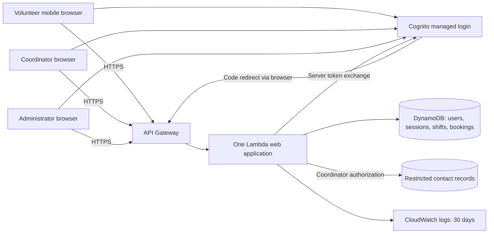

# ARCH-001 — PRD-001 pilot architecture and epic readiness

## Scope and evidence

Define architecture for the six active, current-release requirements of [PRD-001](../prd/PRD-001.md)
v1. Recommend a hosted modular web application, managed identity, stateful revocation,
atomic shift bookings, and coordinator-only contact access. These are proposed design
decisions; this document does not record stakeholder acceptance or create epics.

The workspace contains the PRD and accepted [ADR-001](../adr/ADR-001.md) v1 only before
this change. No repository instructions, implementation, test runner, specification
schema or quality-gate command is present. Referenced BRN-001 is absent; this design
relies on the approved PRD without inventing the missing document's contents. The
PRD's generated epic map and approved text are preserved.

Work plan: (1) identify requirement and decision gaps; (2) describe boundaries, contracts
and alternatives in ADR-002–005; (3) map every requirement to decisions, unresolved
assumptions and future verification; (4) validate document references and source preservation.

## Components and trust boundaries

All clients are untrusted. The application validates session and current role before
accessing protected data. Browsers have no direct storage credentials. Application
service identities receive minimum required permissions. Cloud operator access is a
separate boundary needing the resolution in A-04. Managed services and backups run
off-site; one region avoids cross-region consistency in the revocation guarantee.

The deployment and storage design is [ADR-005](../adr/ADR-005.md); identity is
[ADR-002](../adr/ADR-002.md); shared authorization/revocation is
[ADR-003](../adr/ADR-003.md); phone access is [ADR-004](../adr/ADR-004.md).

## Application contracts

| Operation | Authorization and behavior |
|---|---|
| `GET /sign-in`, `GET /auth/callback` | Begin/complete validated identity flow; create opaque local session only for an active provisioned user |
| `POST /sign-out` | Revoke current application session and clear cookie; no mutation through GET |
| `GET /shifts?date=YYYY-MM-DD` | Active volunteer; availability without other volunteers' identities or contacts |
| `POST /shifts/{id}/bookings` | Active volunteer, CSRF checked; derive volunteer ID from session; atomic capacity/uniqueness enforcement; 201 new, 200 existing, 409 unavailable |
| `GET /coordinator/roster?date=YYYY-MM-DD` | Coordinator; local-day shifts, bookings, volunteer display names and optional phones; empty shifts included |
| `POST /admin/volunteers/{id}/revoke-sessions` | Administrator, CSRF checked; commit shared revocation before reporting success |

Use 401 for a missing/expired/revoked session, 403 for an authenticated role denial,
400 for malformed input, and 503 for unavailable required services. Do not return
partial success for failed booking/revocation writes. A timeout after commit can be
retried without duplicating a booking. All authenticated pages and responses are
non-cacheable; the server never trusts displayed availability or client-supplied roles.

Data shapes, transaction boundaries and roster read consistency are in ADR-005.
Shift provisioning is a controlled operator procedure from coordinator-supplied data;
contact import requires the coordinator's authenticated role. A scheduling editor,
cancellations, waitlists, reminders, payroll and donations
are outside this architecture's implementation scope. The first four are not authorized
features; payroll and donations are explicit PRD non-goals.

## Assumptions and decision closure

Proceeding without an interview means explicit proposals, not presumed answers.
Priya Nair is the recorded PRD owner and the proposed decision owner for these items;
no consultation or agreement is asserted.

| ID | Proposed default or unresolved issue | Affected requirements | Evidence needed to close |
|---|---|---|---|
| A-01 | Volunteers have email; provision invited accounts; operator handles invitations and recovery | FR-001; FR-002/FR-003 inherit sign-in | Confirm email access and name account/recovery operator; verify mobile flow |
| A-02 | “Open” means coordinator-published, future, below fixed capacity; one booking per volunteer per shift; overlaps allowed absent a rule | FR-002 | Confirm booking/capacity semantics and who supplies shifts; document any overlap/cutoff rule before epic criteria |
| A-03 | One configured warehouse IANA timezone; “live” means successful refresh within 30 seconds while page visible and connected | FR-003 and date selection in FR-002 | Supply warehouse timezone and accept refresh target/degraded behavior; avoid inferring location from “Riverside” |
| A-04 | Coordinator alone reads phones; administrator is independent; ordinary operators lack data access | NFR-002; FR-003 | Confirm contact source and whether the rule includes privileged cloud operators; if yes, revise design for that threat model before readiness |
| A-05 | One AWS account/region, managed services and 30-day CloudWatch retention | NFR-003, inherited by every requirement | Name hosting/billing operator, choose region, estimate cost including identity, logs and backups; resolve ADR-001's unverified no-extra-cost rationale |
| A-06 | Administrator revokes all current sessions; fresh sign-in remains allowed; eight-hour app sessions | NFR-001; FR-001/FR-002/FR-003 | Name authorized administrator and accept session/re-authentication defaults; preserve the five-minute maximum |

PRD ASM-01 (smartphone access) remains open; validate it before pilot onboarding as the
PRD requests. SM-01 remains measured through the coordinator's shift log, with the
approved 83% baseline and 95% target. No analytics platform or new success criterion
is inferred. Roll out Tuesday/Thursday shifts first and then all shifts as specified.

## Requirement coverage and epic readiness

For this assessment, **ready** means applicable architecture decisions have recorded
acceptance and no material product ambiguity prevents writing stable epic acceptance
criteria. This is an explicit reporting convention, not a discovered repository rule.
Runtime tests need not pass before drafting an epic; the epic must own their execution.
Proposed designs can support planning sketches but do not count as accepted coverage.

| Requirement | Direct decision | Inherited constraints and dependencies | Current readiness | Remaining closure |
|---|---|---|---|---|
| FR-001: volunteer sign-in | ADR-002 (proposed) | ADR-003 session control; ADR-004 no phone claims/logs; ADR-005 hosted runtime; ADR-001 logging | BLOCKED | Accept applicable ADRs; A-01, A-05, A-06 |
| FR-002: book an open shift | ADR-005 (proposed) | FR-001 / ADR-002; ADR-003 on every booking; ADR-004 response minimization; NFR-003 globally | BLOCKED | Accept applicable ADRs; A-01, A-02, A-03 timezone, A-05, A-06 |
| FR-003: coordinator daily roster | ADR-005 (proposed), ADR-004 (proposed) | ADR-002 coordinator identity; ADR-003 protected reads; NFR-003 globally | BLOCKED | Accept applicable ADRs; A-01, A-03, A-04, A-05, A-06 |
| NFR-001: revoke within five minutes | ADR-003 (proposed) | ADR-005 consistent shared store; ADR-002 fresh-login integration | BLOCKED | Accept applicable ADRs; A-05, A-06; allocate timed verification to identity epic |
| NFR-002: coordinator-only phones | ADR-004 (proposed) | ADR-002 excludes phone claims; ADR-003 role checks; ADR-005 storage/logging boundaries | BLOCKED | Accept applicable ADRs; A-04, A-05; allocate disclosure tests to every affected epic |
| NFR-003: hosted whole product | ADR-005 (proposed) | Every component, including identity, data, logs and backups; ADR-001 retention preserved | BLOCKED | Accept ADR-005; A-05 |

**Current result: 0 of 6 requirements have accepted, complete architecture coverage.**
All six now have explicit proposed coverage. ADR-001's sole upstream link is
`informed_by FR-001`; its accepted log-retention decision does not answer the identity
provider question or satisfy any of the three NFRs by itself. A requirement is not ready
merely because an accepted ADR mentions its ID. NFR-003 constrains the whole product
even where a functional requirement does not explicitly link to it.

## Proposed epic boundaries after closure

These are planning candidates, not created or approved epics; FR-003 retains its
`should` priority, while the other requirements remain `must`.

| Candidate | Requirements and obligations | Sequencing |
|---|---|---|
| Hosted foundation | NFR-003; ADR-001 retention; infrastructure, secrets, backup/restore and deployment | Resolve A-05 and ADR-005 first; establish environment |
| Identity and session control | FR-001 + NFR-001; administrator capability; no phone in identity/logs | Foundation; close ADR-002/003, A-01/A-06 |
| Volunteer booking | FR-002; inherited NFR-001/002/003; atomic capacity and retry behavior | Identity and shared storage; close A-02 and timezone |
| Coordinator roster and contact privacy | FR-003 + NFR-002; role tests, freshness and date boundaries | Identity and booking data; close ADR-004, A-03/A-04 |

Carry NFRs into every affected epic, not only the epic that first implements their shared
mechanism. Do not ship a phone-bearing feature before its privacy controls. Independent
epic drafting may proceed once its own direct and inherited blockers close; there is
no need to wait for unrelated product questions.

## Verification handoff

| Requirement/decision | Future acceptance evidence | Runtime status |
|---|---|---|
| FR-001 | Invited mobile-browser login; unknown subject denied; invalid/replayed callback denied; outage and recovery paths | NOT_RUN |
| FR-002 | One winner for last-place race; safe duplicate retry; full/closed/past shift denied; revoked session cannot book | NOT_RUN |
| FR-003 | Correct local-day roster including empty shifts and all pages; recent booking visible within agreed interval; stale/error indicator | NOT_RUN |
| NFR-001 | Timed multi-session, multi-instance revocation at all protected routes within 300 seconds, with login/write races and store outage | NOT_RUN |
| NFR-002 | Positive coordinator access; negative volunteer/admin access; no phone in unauthorized payloads, claims, logs or caches; operator access review | NOT_RUN |
| NFR-003 | Hosted deployment inventory, no on-site dependency, remote restore exercise | NOT_RUN |
| ADR-001 | All application log groups configured to 30 days; sign-in failure trace available with sensitive fields omitted | NOT_RUN |

These are proposed acceptance checks derived from requirements, not claims of completed
implementation. Implementation should establish meaningful failing tests first and run
the eventual repository's required gates. This documentation-only change has no runtime
behavior or executable test suite against which to establish a failing behavior test.
Document validation against the actual files is recorded in [verification](VERIFICATION-PRD-001.md).
