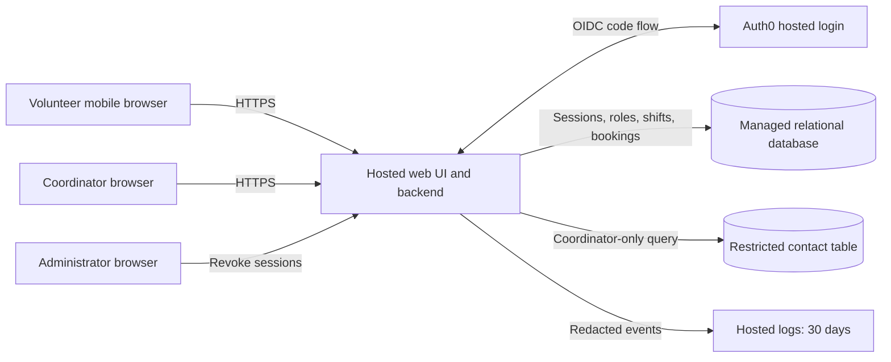

# PRD-001 architecture and epic readiness

The architecture is defined below as a proposal. **All six current requirements have
explicit proposed coverage; none is unconditionally ready for implementation epics.**
New decisions are proposed, with specific unresolved inputs. This is a readiness
assessment, not an acceptance record or a claim that the product passes its requirements.

## Basis and scope

Source: [PRD-001 version 1, approved 2026-09-20](../prd/PRD-001.md), for mobile browser
sign-in, shift booking and the coordinator's daily roster. Preserve the approved PRD and
its generated epic map. Payroll, donations, native apps, cancellation, waiting lists and
new administrative product features are outside scope. No epics are created by this task.

The only existing decision is [ADR-001](../adr/ADR-001.md), accepted for 30-day hosted
application logs. It is relevant context for FR-001, not an identity-provider decision,
session-revocation design, privacy decision or whole-product hosting decision.

This workspace contains no application code, AGENTS.md, skill instructions, templates,
test commands or quality gates. BRN-001 is referenced by the PRD but is not available;
no claims from that missing document are needed or inferred. New document metadata
follows the existing ADR style; ARCH-001 is a local assessment, not an asserted schema standard.

Plan: map each requirement to a decision; define boundaries and failure behavior; identify
decision and product gaps; verify traceability and preserve source documents.

## System boundaries

The contact table is in the same managed database, with a separate permission path.
Only the backend holds database credentials; the browser is an untrusted caller.
Identity verification, authorization and booking integrity are separate responsibilities.

| Boundary | Responsibility | Decision |
|---|---|---|
| Identity/session module | Provider callback, user binding, opaque sessions and administrator revocation | [ADR-002](../adr/ADR-002.md), proposed |
| Authorization/contact module | Current role checks, coordinator-only phone queries, explicit response fields | [ADR-003](../adr/ADR-003.md), proposed |
| Booking module | Open shifts, capacity transaction, duplicate prevention and own booking confirmation | [ADR-004](../adr/ADR-004.md), proposed |
| Coordinator module | Daily committed roster, contact projection and refresh | ADR-003 and ADR-004, proposed |
| Hosted infrastructure | Application, identity, database, secrets, backups and logs hosted off-site | ADR-004, proposed; ADR-001 accepted only for logs |

## Data and interface contracts

| Entity | Minimum data and invariant |
|---|---|
| User | Internal ID, unique identity issuer/subject, display name, session generation and revocation boundary |
| RoleGrant | User ID and explicit role; browser cannot grant or edit roles |
| Session | Token digest, user ID, issued generation, creation/expiry; generation must match current user |
| LoginAttempt | One-use state/nonce, start time and expiry; pre-revocation attempts cannot issue a new session |
| VolunteerContact | Volunteer ID and phone; coordinator query path only |
| Shift | ID, start/end instants, capacity, open/closed; capacity cannot fall below bookings |
| Booking | Shift ID, volunteer ID and creation time; unique shift/volunteer pair |
| Site configuration | Food bank IANA time zone; actual value unresolved |

Proposed API contracts guide epic slicing; exact route naming can change without altering
the boundaries:

| Operation | Access and behavior |
|---|---|
| Sign-in start/callback | OIDC flow; only mapped users receive an application session; failures grant no access |
| List open shifts | Signed-in volunteer; returns shift availability, without other volunteers' contacts |
| Book a shift | Signed-in volunteer books as self; success after commit; duplicate returns existing booking; full/closed is a conflict |
| Daily roster | Coordinator; local date mapped to UTC boundaries; committed volunteers grouped by shift, including empty shifts |
| Read roster contacts | Coordinator only; allowlisted contact projection, no shared cache |
| Revoke volunteer sessions | Administrator only; all existing sessions invalidated atomically; success only after commit |

An invalid/revoked session is denied, an authenticated caller with the wrong role is
forbidden, and unavailable dependencies cause explicit failure. Never return a successful
booking or revocation from a speculative client update. Polling failures show stale roster
state rather than implying fresh data. Do not log provider codes, cookies or phone numbers.

## Requirement coverage and readiness

For this assessment, **ready** means substantive architectural coverage in accepted
decisions, with no unresolved material input affecting that requirement. A reference alone
does not count as coverage. Proposed coverage supports discussion and candidate slicing,
but cannot be represented as accepted architecture. Runtime verification remains separate.

| Requirement | Substantive decision coverage | Epic readiness | Remaining gate |
|---|---|---|---|
| FR-001: volunteer sign-in | ADR-002; hosted deployment in ADR-004. ADR-001 covers logs only. | BLOCKED | Accept identity/session and hosting decisions; settle G-01 and G-03. PRD's NEEDS ADR marker remains unresolved until acceptance. |
| FR-002: signed-in volunteer books open shift | ADR-004 transaction and openness; ADR-002 sessions; ADR-003 contact exclusion | BLOCKED | Accept ADR-002–004; settle G-01, G-02 and G-03. |
| FR-003: coordinator daily roster | ADR-003 access; ADR-004 committed roster and local-day query; ADR-002 sessions | BLOCKED | Accept ADR-002–004; settle G-01, G-03, G-04 and G-05. |
| NFR-001: revoke within five minutes | ADR-002 generation invalidation and enforcement; ADR-004 shared hosted state | BLOCKED | Accept ADR-002 and ADR-004; settle G-01 and G-03, including fresh-login semantics. |
| NFR-002: phones visible only to coordinator | ADR-003 permissions and data paths; ADR-002 current sessions/roles; ADR-004 hosted data | BLOCKED | Accept ADR-002–004; settle G-01, G-03 and G-05. |
| NFR-003: whole product on hosted services | ADR-004 covers all runtime components, including ADR-002 identity and ADR-001 logging | BLOCKED | Accept ADR-004; settle G-03. Applies to every epic, not just an infrastructure epic. |

No requirement is missing a proposed design. No requirement is ready solely because
ADR-001 references FR-001. All three NFRs are mandatory for the pilot; FR-003 remains
`should` as specified in the PRD.

## Material gaps and working assumptions

No questions were asked, as requested. These proposed defaults make review concrete;
they do not change the approved requirements or assert stakeholder agreement. Priya Nair
is the proposed decision owner because she owns PRD-001; operational owners still need
assignment where noted.

| Gap | Proposed default and resolution needed | Affected scope |
|---|---|---|
| G-01 | Auth0 invited email/password accounts; validate email access, recovery, tenant ownership and plan. Session revocation requires fresh authentication but does not suspend the account. Validate the integration and accept ADR-002. | FR-001 and dependent authenticated flows; NFR-001 |
| G-02 | Open means explicitly open, before start, with capacity; one booking per volunteer/shift. Confirm shift capacities and who supplies the schedule before accepting ADR-004. | FR-002 |
| G-03 | Managed app and relational database with hosted logs, secrets and backups. Provider, region, affordable plan and operating/restore ownership remain unselected; verify ADR-001 retention compatibility before accepting ADR-004. | NFR-003 globally, therefore all epics |
| G-04 | Roster refresh every 30 seconds plus manual refresh; shift start date determines local-day grouping. Confirm freshness expectation and actual food bank time zone. | FR-003 |
| G-05 | Separate coordinator and administrator grants; restricted import of existing contacts. Identify role-provisioning and contact-import owner; confirm the application administrator is not entitled to phone access without coordinator status. | FR-003, NFR-002 |

ASM-01 (smartphone access) remains an open product assumption, not something architecture
can validate. SM-01 remains measured by the coordinator's shift log: no new analytics
pipeline is required. Pilot Tuesday/Thursday scheduling and later expansion use the same
architecture. No deployment or procurement has been performed.

## Candidate epic boundaries after the gates clear

These are planning candidates, not ready or created epics. Dependencies are explicit.

| Candidate | Requirement scope | Dependency and exit evidence |
|---|---|---|
| Hosted foundation | NFR-003 and inherited ADR-001 | ADR-004 accepted and G-03 resolved; V-06 |
| Volunteer identity and session administration | FR-001, NFR-001; inherits NFR-002 and NFR-003 | Foundation, accepted ADR-002 and applicable ADR-003 controls; V-01, V-04, V-05 |
| Shift discovery and booking | FR-002; inherits NFR-001–003 | Foundation and identity; accepted ADR-004 booking rules; V-02 plus authorization/privacy regressions |
| Coordinator roster and contacts | FR-003, NFR-002; inherits NFR-001 and NFR-003 | Foundation, identity and booking model; accepted ADR-003–004; V-03, V-05 |

Every epic should cite the specific PRD items and applicable accepted ADRs. Reassess this
table after decisions change; acceptance of one ADR does not automatically clear the rest.

## Verification contracts

These are proposed implementation acceptance tests, **NOT_RUN** because no implementation
or test harness exists. They are not fabricated passing evidence. No behavior change was
made, so a failing TDD test cannot be established in this architecture-only workspace.

| Contract | Requirement | Required evidence | Current result |
|---|---|---|---|
| V-01 | FR-001 | Mapped volunteer signs in on a mobile browser; invalid callback, unknown identity and expired session fail without granting access. | NOT_RUN |
| V-02 | FR-002 | Valid booking appears once; concurrent last-seat attempts yield exactly one success; retry creates no duplicate; closed, started, full and anonymous attempts create nothing. | NOT_RUN |
| V-03 | FR-003 | Coordinator sees correct volunteers and empty shifts for the selected local day; test midnight/DST boundaries, post-commit refresh and stale/error display. Non-coordinators are denied. | NOT_RUN |
| V-04 | NFR-001 | Administrator revokes all target sessions on multiple instances/devices; repeated requests with every old cookie fail within 300 seconds of success; test login/write races, renewal bypass, wrong-role callers and database outage. | NOT_RUN |
| V-05 | NFR-002 | Only coordinator receives a synthetic phone number. Anonymous, volunteer and administrator-only endpoints, HTML, tokens, logs, caches and database query paths do not disclose it. | NOT_RUN |
| V-06 | NFR-003 and ADR-001 | Inspect deployed inventory: every runtime dependency hosted; verify TLS, secrets, database recovery and provider log retention of 30 days. | NOT_RUN |

## Document verification

See [verification evidence](PRD-001-verification.md) for commands, source fingerprints,
coverage checks and remaining limitations against the authored document state.
