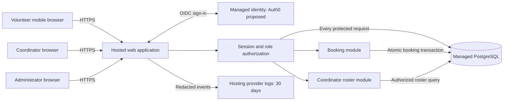

# ARCH-001 — PRD-001 architecture and epic readiness

## Scope and outcome

Architecture for [PRD-001 v1](../prd/PRD-001.md), covering all three current functional requirements and all three current non-functional requirements. Recommend a mobile-first hosted modular web application, managed identity, and one managed relational database. No implementation, deployment or epics are created by this document.

**All six requirements have a proposed design; none is unconditionally ready for committed epics.** The product-wide hosting decision remains unresolved. Identity and privacy decisions also have explicit closure conditions below. Epic outlines can be drafted against these proposals, but must retain the gates rather than claim settled architecture.

For this assessment, “ready” means the relevant architecture decisions are accepted and material uncertainties affecting the requirement are resolved. This is the assessment convention, not a claim that a repository workflow mandates an approval process. Existing document status is evidence: ADR-001 is accepted; ADR-002 through ADR-004 are proposed. No approval on behalf of Priya Nair is recorded.

## System boundaries

The browser is untrusted. The server derives the caller from an opaque session cookie and authorizes every protected operation. Provider identity establishes who signed in; application data establishes their roles and session validity. Neither the browser nor the identity provider can directly query the application database. Hosting, database, identity and logging are all hosted services under NFR-003.

| Component | Responsibility | Boundary |
|---|---|---|
| Web UI and backend | Phone-friendly pages, validation, response shaping, CSRF protection | Same-origin HTTPS; no sensitive browser persistence |
| Identity/session module | OIDC callbacks, internal identity mapping, live role/session checks, administrator revocation | Provider tokens never serve as direct application API credentials |
| Booking module | List open shifts, book for the current volunteer, prevent duplicates and overbooking | One primary-database transaction per booking |
| Coordinator module | Daily roster and permitted contact fields | Coordinator role required on every request |
| Managed database | Profiles, roles, sessions, shifts, bookings, isolated contact data | Backend-only credentials; primary reads for authorization and roster |
| Provider log service | Sign-in, authorization, booking and revocation outcomes for 30 days | Internal identifiers only; no phone numbers, tokens or credentials |

## Data and interaction contracts

| Entity | Minimum data and invariant |
|---|---|
| Volunteer | Internal ID, display name, unique `(identity_issuer, identity_subject)`, current session generation; no phone field in general profile |
| Role assignment | Explicit volunteer, coordinator and administrator permissions; administrator does not inherit coordinator access |
| VolunteerContact | Volunteer ID and phone number; accessible only through coordinator-authorized application queries |
| Session | Hashed opaque secret, volunteer ID, generation, expiry; generation must match the current volunteer record |
| Login attempt | Short-lived state/nonce/PKCE context and generation at initiation; single use; invalid across revocation |
| Shift | ID, start/end instants, published state, positive capacity; local date derived using the configured food-bank timezone |
| Booking | ID, shift ID, volunteer ID, creation instant; unique `(shift_id, volunteer_id)` |

Proposed routes illustrate boundaries, not a mandated framework:

- `GET /auth/login` and `/auth/callback`: managed sign-in, validated callback and new local session. Unknown identities receive no volunteer access.
- `GET /shifts?date=...`: authenticated volunteers receive shift times and availability without volunteer contact data.
- `POST /shifts/{id}/bookings`: derive volunteer ID from session; lock shift, check openness/capacity, insert and commit. Duplicate retries return the existing booking; a full/closed shift returns a conflict without a write.
- `GET /coordinator/roster?date=...`: coordinator-only query returns shifts and booked volunteers for that local day. Commit-visible reads use the primary database. Proposed UI polling interval is 30 seconds while visible, with manual refresh, last-updated time and an explicit stale/error state; the PRD does not define a freshness SLA.
- `POST /admin/volunteers/{id}/revoke-sessions`: administrator-only atomic generation increment, acknowledged after commit. No contact fields are returned. Invalid sessions receive unauthorized responses; insufficient roles receive forbidden responses.

The pilot uses provisioned Tuesday/Thursday shifts and expands by publishing additional shifts. Capacity, initial enrollment, local timezone and contact import need owner validation. Cancellation, waiting lists, reminders, payroll and donations are not introduced. SM-01 remains measured through the coordinator's shift log; architecture does not replace the approved metric with booking counts.

## Decision register

| Decision | Status | Actual scope |
|---|---|---|
| [ADR-001](../adr/ADR-001.md) | accepted | Application log retention only; its FR-001 upstream link does not resolve the identity provider or prove security coverage |
| [ADR-002](../adr/ADR-002.md) | proposed | FR-001 identity; NFR-001 revocation, with shared session authorization used by FR-002 and FR-003 |
| [ADR-003](../adr/ADR-003.md) | proposed | NFR-002 phone visibility, FR-003 roster authorization, and exclusion of contacts from other responses |
| [ADR-004](../adr/ADR-004.md) | proposed | NFR-003 whole-product hosted deployment; FR-002 atomic booking and FR-003 consistent roster; supports shared session/contact storage |

## Requirement readiness and acceptance evidence

Readiness is assessed per requirement, including transitive and global dependencies. A requirement's presence in an ADR is not sufficient: the decision must address its actual behavior. Proposed decisions provide design coverage, not accepted coverage or runtime proof.

| Requirement | Direct design | Additional dependencies | Epic readiness now | Required acceptance evidence after implementation |
|---|---|---|---|---|
| FR-001 sign-in | ADR-002 | ADR-004 hosting; ADR-001 logs; NFR-001 sessions and NFR-002 disclosure controls | BLOCKED: G1, G2, G3 | Known volunteer signs in from a mobile browser; invalid callbacks and unknown identities fail; protected pages require a current session |
| FR-002 book open shift | ADR-004 | FR-001/ADR-002; NFR-001, NFR-002, NFR-003 | BLOCKED: G1, G2, G3, G4 | Successful booking persists; closed/full shift denied; two contenders for one place yield one booking; retry does not duplicate; revoked session cannot book |
| FR-003 daily roster | ADR-003 and ADR-004 | FR-001/ADR-002; all three NFRs | BLOCKED: G1, G2, G3, G4 | Coordinator sees committed bookings for the correct local day; other roles denied; refresh/stale behavior explicit; contact data not leaked |
| NFR-001 revocation | ADR-002 | ADR-004 primary session store; administrator role | BLOCKED: G1, G2 | All existing devices and instances reject revoked sessions within 300 seconds; concurrent callbacks/refresh cannot restore them; lookup failures deny access |
| NFR-002 phone privacy | ADR-003 | ADR-002 current roles; ADR-004 storage/logging | BLOCKED: G1, G2, G3 | Coordinator-only contact responses; no numbers in volunteer/admin-only responses, logs, errors or caches; operational access review |
| NFR-003 hosted product | ADR-004 | ADR-001 compatible provider logs; hosted identity in ADR-002 | BLOCKED: G1, G2 | Deployment inventory contains no on-site dependency; provider/plan meets log retention; database restart/restore and protected connectivity verified |

### Gate closure

| Gate | Material uncertainty and closure evidence | Proposed owner |
|---|---|---|
| G1 — whole-product hosting | Select provider/plan, validate cost and 30-day native log retention, and accept ADR-004. ADR-001's no-extra-cost assumption is unverified. Any incompatible alternative needs an explicit superseding ADR; merely linking ADR-001 does not satisfy NFR-003. | Priya Nair with implementer |
| G2 — identity and session policy | Confirm provider/tenant, usable enrollment and recovery method, fresh-authentication semantics after revocation, and accept ADR-002. This resolves PRD-001 section 12 only once recorded as accepted. | Priya Nair with implementer |
| G3 — privacy and roles | Accept ADR-003, confirm the coordinator/admin distinction and operational custody interpretation, and identify the authorized contact importer. | Priya Nair |
| G4 — booking and daily boundaries | Validate the proposed capacity/open-shift rule, shift provisioning and food-bank timezone. Do not infer the food bank's timezone from the agent environment. Record product clarifications before final story acceptance criteria. | Priya Nair |

No questions were required to produce this proposal. These are recorded follow-up decisions, not fabricated answers. BRN-001 and evidence validating PRD assumption ASM-01 are absent from the workspace; this assessment uses the approved PRD and does not claim to revalidate those upstream facts.

## Epic decomposition once gates close

These are candidate scopes, not created epic IDs or edits to the PRD's generated epic map:

1. **Hosted application foundation** — NFR-003 and ADR-001 logging, deployment, managed database, secrets and recovery. Supplies infrastructure to all other work.
2. **Volunteer identity and session administration** — FR-001 and NFR-001; identity mapping, roles, sign-in, revocation and shared authorization checks. Depends on foundation.
3. **Volunteer shift booking** — FR-002; shift listing, atomic capacity checks, duplicate-safe booking and mobile feedback. Depends on identity and foundation; applies NFR-002 to responses.
4. **Coordinator daily roster and contact privacy** — FR-003 and NFR-002; current bookings, role-restricted contacts and disclosure tests. Depends on shared identity/data contracts and booking data. FR-003 retains its PRD `should` priority; NFR-002 remains `must` even if the roster is deferred.

NFR-001 and NFR-002 checks also belong in every protected feature's acceptance criteria; assigning a primary epic does not remove cross-cutting obligations. Do not infer that no epics can be outlined while gates are open; the limitation is commitment against unresolved decisions.

## Verification record

See [ARCH-001 verification](ARCH-001-verification.md) for commands and results against this documentation state. All runtime acceptance scenarios above are **NOT_RUN**: this workspace contains specifications only, without application code or a test harness. No behavior changed, so there is no meaningful runtime failing test to establish here. Future implementation must start with failing acceptance tests and then apply repository-defined checks when available.
