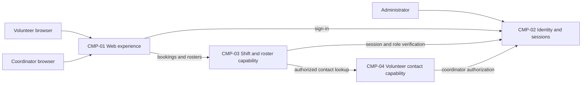

# ARCH-001 — Volunteer shift sign-up for the Riverside Food Bank architecture

## 1. Context and scope

This draft examines approved PRD-001 version 1, owned by Priya Nair. The system lets
approximately 120 volunteers sign in and book warehouse shifts from a mobile browser,
and lets the coordinator view daily rosters. Session revocation, contact privacy and
hosted operation are in scope. Payroll, donations and an installed mobile app are outside
the product scope.

No inspection scope was named and no code or configuration was inspected. The PRD and
ADR-001 are the project evidence consulted. No existing ARCH covers this system, so a
new ARCH is proposed. The request selected PRD-001 and instructed proceeding without
questions; it did not confirm the create outcome or any architectural decision.
The outcome therefore remains null and all architectural questions remain open.

## 2. Quality drivers

PRD-001#NFR-001 requires administrator-initiated revocation of volunteer sessions to
take effect within five minutes. The authentication and protected booking paths must
share a revocation mechanism; choosing an identity provider alone does not establish
this guarantee. PRD-001#NFR-002 limits phone-number visibility to the coordinator,
requiring a trusted role boundary and control over contact-data reads and disclosures.
PRD-001#NFR-003 requires hosted services for the whole product because no on-site
server is available. It governs every functional requirement and both other NFRs.

The operating context is internal, as recorded in the PRD; the Pilot release name does
not override that context. The required framework categories are constraint, security
and privacy, covered respectively by PRD-001#NFR-003, PRD-001#NFR-001 and
PRD-001#NFR-002. No required category is missing. There are no applied policy settings.
No further availability, performance or budget targets are assumed.

## 3. Components

The following are proposed logical responsibilities, not accepted service boundaries or
deployment units. ARCH-001#DEC-06 records the boundary choice. Data ownership and
interactions below remain proposals subject to the linked questions.



```yaml items
components:
  - id: CMP-01
    status: active
    name: "Web experience"
    responsibility: "Proposed mobile browser interface for sign-in, booking and coordinator rosters; does not own authoritative records or decide access rights."
    owns_data: []
    interacts_with:
      - "CMP-02"
      - "CMP-03"
    deployment: "Open: see DEC-05"
    upstream:
      - {id: PRD-001, item: NFR-002, relation: informed_by, version: 1, hash: null}
      - {id: PRD-001, item: NFR-003, relation: informed_by, version: 1, hash: null}
  - id: CMP-02
    status: active
    name: "Identity and sessions"
    responsibility: "Proposed authentication, trusted role assertions and administrator session revocation capability; does not own shift bookings. Provider and revocation mechanism remain open in DEC-01 and DEC-02."
    owns_data:
      - "Proposed authentication identities and session lifecycle records; exact ownership depends on DEC-01 and DEC-02"
    interacts_with:
      - "CMP-01"
      - "CMP-03"
      - "CMP-04"
    deployment: "Open: see DEC-05"
    upstream:
      - {id: PRD-001, item: NFR-001, relation: informed_by, version: 1, hash: null}
      - {id: PRD-001, item: NFR-002, relation: informed_by, version: 1, hash: null}
      - {id: PRD-001, item: NFR-003, relation: informed_by, version: 1, hash: null}
  - id: CMP-03
    status: active
    name: "Shift and roster capability"
    responsibility: "Proposed booking authority and coordinator roster view, checking sessions before protected operations; does not own credentials or phone numbers. Booking ownership and roster interaction remain open in DEC-07 and DEC-08."
    owns_data:
      - "Proposed warehouse shift and booking records, subject to DEC-07"
    interacts_with:
      - "CMP-01"
      - "CMP-02"
      - "CMP-04"
    deployment: "Open: see DEC-05"
    upstream:
      - {id: PRD-001, item: NFR-001, relation: informed_by, version: 1, hash: null}
      - {id: PRD-001, item: NFR-002, relation: informed_by, version: 1, hash: null}
      - {id: PRD-001, item: NFR-003, relation: informed_by, version: 1, hash: null}
  - id: CMP-04
    status: active
    name: "Volunteer contact capability"
    responsibility: "Proposed authority for volunteer contact records and coordinator-only phone disclosure; does not own bookings or authentication credentials. Ownership and access enforcement remain open in DEC-03 and DEC-04."
    owns_data:
      - "Proposed volunteer contact records including phone numbers, subject to DEC-03"
    interacts_with:
      - "CMP-02"
      - "CMP-03"
    deployment: "Open: see DEC-05"
    upstream:
      - {id: PRD-001, item: NFR-002, relation: informed_by, version: 1, hash: null}
      - {id: PRD-001, item: NFR-003, relation: informed_by, version: 1, hash: null}
```

## 4. Architectural questions

Each question is blocking. The request to proceed without questions supplies no
decision, and there is no mandated platform that resolves any of these questions.
ADR-001 concerns log retention only; sharing a PRD requirement link does not make it
a resolver for identity, session revocation or hosting selection.

```yaml items
decisions:
  - id: DEC-01
    status: active
    question: "Which identity provider handles volunteer sign-in?"
    blocking: true
    state: open
    resolved_by: []
    notes: "Required by the PRD NEEDS ADR marker. Provider integration affects signed-in booking and the available session lifecycle controls. ADR-001 answers only log retention. No option has been accepted."
    upstream:
      - {id: PRD-001, item: FR-001, relation: informed_by, version: 1, hash: null}
      - {id: PRD-001, item: FR-002, relation: informed_by, version: 1, hash: null}
      - {id: PRD-001, item: NFR-001, relation: informed_by, version: 1, hash: null}
  - id: DEC-02
    status: active
    question: "How will administrator revocation invalidate volunteer sessions throughout protected operations within five minutes?"
    blocking: true
    state: open
    resolved_by: []
    notes: "Sign-in creates the sessions and booking consumes them. Shared revocation checks or bounded session lifetimes have different availability and enforcement trade-offs; no mechanism is accepted."
    upstream:
      - {id: PRD-001, item: FR-001, relation: informed_by, version: 1, hash: null}
      - {id: PRD-001, item: FR-002, relation: informed_by, version: 1, hash: null}
      - {id: PRD-001, item: NFR-001, relation: informed_by, version: 1, hash: null}
  - id: DEC-03
    status: active
    question: "Which capability is the authoritative owner of volunteer contact data used by the coordinator?"
    blocking: true
    state: open
    resolved_by: []
    notes: "CMP-04 proposes a contact authority. Keeping contacts with identity or with application records changes ownership and exposure boundaries; no choice is accepted. Roster integration must use the agreed volunteer identity reference."
    upstream:
      - {id: PRD-001, item: FR-003, relation: informed_by, version: 1, hash: null}
      - {id: PRD-001, item: NFR-002, relation: informed_by, version: 1, hash: null}
  - id: DEC-04
    status: active
    question: "Where will trusted coordinator authorization enforce phone-number visibility across contact and roster access?"
    blocking: true
    state: open
    resolved_by: []
    notes: "The volunteer booking path must not disclose phone numbers, while coordinator access needs a trusted role boundary. Central application authorization and data-service enforcement have different integration costs; no enforcement boundary is accepted. Browser visibility controls alone cannot establish the requirement."
    upstream:
      - {id: PRD-001, item: FR-002, relation: informed_by, version: 1, hash: null}
      - {id: PRD-001, item: FR-003, relation: informed_by, version: 1, hash: null}
      - {id: PRD-001, item: NFR-002, relation: informed_by, version: 1, hash: null}
  - id: DEC-05
    status: active
    question: "Which hosted deployment topology will run the whole product?"
    blocking: true
    state: open
    resolved_by: []
    notes: "NFR-003 applies to the whole product. Hosted application units with managed persistence or a managed backend platform are possible shapes; providers, deployment units and environments remain undecided. ADR-001 selects a logging location but does not select a host."
    upstream:
      - {id: PRD-001, item: FR-001, relation: informed_by, version: 1, hash: null}
      - {id: PRD-001, item: FR-002, relation: informed_by, version: 1, hash: null}
      - {id: PRD-001, item: FR-003, relation: informed_by, version: 1, hash: null}
      - {id: PRD-001, item: NFR-001, relation: informed_by, version: 1, hash: null}
      - {id: PRD-001, item: NFR-002, relation: informed_by, version: 1, hash: null}
      - {id: PRD-001, item: NFR-003, relation: informed_by, version: 1, hash: null}
  - id: DEC-06
    status: active
    question: "What logical component boundaries separate the web experience, identity, shifts and contact responsibilities?"
    blocking: true
    state: open
    resolved_by: []
    notes: "CMP-01 through CMP-04 propose responsibility boundaries. Application modules or separately integrated capabilities offer different coordination and operating costs. The split is not approved; runtime placement is a separate question in DEC-05."
    upstream:
      - {id: PRD-001, item: FR-001, relation: informed_by, version: 1, hash: null}
      - {id: PRD-001, item: FR-002, relation: informed_by, version: 1, hash: null}
      - {id: PRD-001, item: FR-003, relation: informed_by, version: 1, hash: null}
      - {id: PRD-001, item: NFR-001, relation: informed_by, version: 1, hash: null}
      - {id: PRD-001, item: NFR-002, relation: informed_by, version: 1, hash: null}
  - id: DEC-07
    status: active
    question: "Which component owns authoritative shift availability and booking records?"
    blocking: true
    state: open
    resolved_by: []
    notes: "CMP-03 proposes one booking authority shared by booking and roster work. A single authority simplifies consistency; split authorities require coordination. No ownership choice is accepted. Exact storage fields and transaction implementation belong in specifications."
    upstream:
      - {id: PRD-001, item: FR-002, relation: informed_by, version: 1, hash: null}
      - {id: PRD-001, item: FR-003, relation: informed_by, version: 1, hash: null}
  - id: DEC-08
    status: active
    question: "How will committed bookings become visible in the coordinator's daily roster?"
    blocking: true
    state: open
    resolved_by: []
    notes: "Reading the booking authority directly avoids projection lag; an event-fed roster adds a synchronization and freshness obligation. The PRD calls for a live roster but sets no numeric freshness target. No interaction model or new product target is accepted."
    upstream:
      - {id: PRD-001, item: FR-002, relation: informed_by, version: 1, hash: null}
      - {id: PRD-001, item: FR-003, relation: informed_by, version: 1, hash: null}
```

## 5. Evidence inspected

```yaml items
evidence:
  - id: EVD-01
    status: active
    source: "PRD-001"
    kind: prd
    finding: "Version 1, status approved: volunteer sign-in, signed-in shift booking and coordinator rosters; five-minute session revocation, coordinator-only phone visibility and hosted operation; internal operating context and an unresolved identity-provider marker."
    classification: context
  - id: EVD-02
    status: active
    source: "ADR-001"
    kind: adr
    finding: "Version 1, status accepted (superseded_by null): retain application logs for 30 days in the hosting provider's log service. Cites FR-001 but does not answer identity selection, session revocation or hosted deployment topology. No user confirmation applies it to any DEC in this draft."
    classification: decided
```

## 6. Deployment

All product capabilities must run on hosted services under PRD-001#NFR-003. A browser
is the user access surface; no on-site server is proposed. Actual providers, persistence,
deployment units and environment separation remain open in ARCH-001#DEC-05. Logical
components do not imply one deployment per component. Authentication and contact
authorization interactions must remain enforceable across whichever units are chosen.

ADR-001 records 30-day application log retention in the eventual hosting provider's
log service. That existing decision supplies neither the hosting selection nor evidence
of an implemented logging service. No availability or cost claim has been verified.

## 7. Requirement changes proposed to the PRD owner

- None.

## 8. Open questions

- [NEEDS CLARIFICATION: No inspection scope was named and no code or configuration was inspected; existing services, deployment capabilities and opportunities for component reuse are unknown.]
- [NEEDS CLARIFICATION: host model/session identity unavailable]
- [NEEDS CLARIFICATION: The create outcome for ARCH-001 is proposed but unconfirmed; proceeding without questions does not confirm it.]
- [NEEDS CLARIFICATION: PRD-001 describes a live roster without a numeric freshness target; Priya Nair owns any product clarification needed when evaluating ARCH-001#DEC-08.]

## Change Log

| Version | Date | Author | Change | Items affected |
|---|---|---|---|---|
| 1 | 2026-09-28 | codex (session unknown) | Initial draft for PRD-001 v1; proposed components and eight open architectural questions; provenance validation unresolved. Policy resolution: interview.max_calls=8 (default); architecture.mandated_platforms=none (default); quality.required_categories=floor only (default) | all |
| 1 | 2026-09-28 | codex (session unknown) | Validation audit: ERR-05, exact host model and session identity unavailable; self-check item 3 (BEH-13 / VER-14) remains unresolved. Draft and empty approval fields retained; no ADR or resolved DEC required restoration. Readiness handoff withheld. Policy resolution: interview.max_calls=8 (default); architecture.mandated_platforms=none (default); quality.required_categories=floor only (default) | generated_by |
