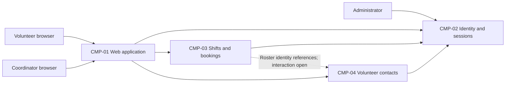

# ARCH-001 — Volunteer shift sign-up for the Riverside Food Bank architecture

## 1. Context and scope

This draft describes volunteer sign-in, warehouse-shift booking and the coordinator's daily roster for PRD-001 version 1, status approved, owned by Priya Nair. About 120 volunteers use mobile-first web pages. Payroll, donations and a native installed app are outside this product scope.

No inspection scope was named, so no code or configuration was inspected. Analysis used the PRD and ADR-001 through the contract document paths. No existing ARCH, policy documents or local preferences were found. Existing implementation and reuse suitability remain unknown.

The proposed outcome is create because no ARCH covers this system. The request to define architecture does not confirm that outcome, so it remains null. The request explicitly says to proceed without questions: no architectural choices are accepted, no ADR is written, and all proposed boundaries remain open.

## 2. Quality drivers

PRD-001#NFR-001 requires administrator revocation of volunteer sessions to take effect within five minutes. It affects the identity/session capability and each protected booking operation, independently of provider selection (ARCH-001#DEC-01 and ARCH-001#DEC-02).

PRD-001#NFR-002 restricts volunteer phone numbers to the coordinator. Contact ownership and a trusted authorization boundary must agree across the roster and contact capabilities (ARCH-001#DEC-05 and ARCH-001#DEC-06).

PRD-001#NFR-003 requires hosted services for the whole product because the food bank has no on-site server. Every runtime capability and durable store must comply; the deployment topology remains ARCH-001#DEC-08.

The PRD operating context is internal. The framework floor is constraint, security and privacy, all covered by these three NFRs. No additional quality categories are required by policy. The release label Pilot does not change the explicit operating context. No extra performance or availability targets are assumed.

## 3. Components

These are proposed logical capabilities. Diagram arrows show intended collaboration, not accepted protocols or deployment boundaries. Data ownership shown below is conditional on the corresponding open decisions. Separate boxes do not require separate services.



```yaml items
components:
  - id: CMP-01
    status: active
    name: "Volunteer and coordinator web application"
    responsibility: "Proposed mobile browser interface for sign-in, bookings and daily rosters; delegates durable records and access enforcement to hosted capabilities."
    owns_data: []
    interacts_with:
      - "CMP-02"
      - "CMP-03"
      - "CMP-04"
    deployment: "Open: see ARCH-001#DEC-08"
    upstream:
      - {id: PRD-001, item: NFR-001, relation: informed_by, version: 1, hash: null}
      - {id: PRD-001, item: NFR-002, relation: informed_by, version: 1, hash: null}
      - {id: PRD-001, item: NFR-003, relation: informed_by, version: 1, hash: null}
  - id: CMP-02
    status: active
    name: "Identity and session capability"
    responsibility: "Proposed authentication and session validation/revocation boundary; does not own shift bookings or volunteer phone numbers. Provider and implementation remain open."
    owns_data:
      - "Proposed ownership: identity subjects, authentication material and session/revocation state"
    interacts_with:
      - "CMP-01"
      - "CMP-03"
      - "CMP-04"
    deployment: "Open: see ARCH-001#DEC-08"
    upstream:
      - {id: PRD-001, item: NFR-001, relation: informed_by, version: 1, hash: null}
      - {id: PRD-001, item: NFR-003, relation: informed_by, version: 1, hash: null}
  - id: CMP-03
    status: active
    name: "Shift and booking capability"
    responsibility: "Proposed authoritative shift and booking boundary supplying the daily roster; does not own credentials or volunteer phone numbers."
    owns_data:
      - "Proposed ownership: warehouse shifts, availability and bookings keyed by volunteer identity"
    interacts_with:
      - "CMP-01"
      - "CMP-02"
      - "CMP-04"
    deployment: "Open: see ARCH-001#DEC-08"
    upstream:
      - {id: PRD-001, item: NFR-001, relation: informed_by, version: 1, hash: null}
      - {id: PRD-001, item: NFR-002, relation: informed_by, version: 1, hash: null}
      - {id: PRD-001, item: NFR-003, relation: informed_by, version: 1, hash: null}
  - id: CMP-04
    status: active
    name: "Volunteer contact capability"
    responsibility: "Proposed contact-data boundary enforcing coordinator-only phone access; does not own credentials or bookings. This may be a module rather than a separate service."
    owns_data:
      - "Proposed ownership: volunteer phone numbers associated with volunteer identity"
    interacts_with:
      - "CMP-01"
      - "CMP-02"
      - "CMP-03"
    deployment: "Open: see ARCH-001#DEC-08"
    upstream:
      - {id: PRD-001, item: NFR-002, relation: informed_by, version: 1, hash: null}
      - {id: PRD-001, item: NFR-003, relation: informed_by, version: 1, hash: null}
```

## 4. Architectural questions

```yaml items
decisions:
  - id: DEC-01
    status: active
    question: "Which identity provider handles volunteer sign-in?"
    blocking: true
    state: open
    resolved_by: []
    notes: "PRD-001 section 12 explicitly requires this decision. ADR-001 concerns log retention, not identity-provider selection. No platform is mandated. The provider must support authenticated booking and the revocation design, but selecting it alone does not answer ARCH-001#DEC-02."
    upstream:
      - {id: PRD-001, item: FR-001, relation: informed_by, version: 1, hash: null}
      - {id: PRD-001, item: FR-002, relation: informed_by, version: 1, hash: null}
      - {id: PRD-001, item: NFR-001, relation: informed_by, version: 1, hash: null}
  - id: DEC-02
    status: active
    question: "How will administrator revocation stop a volunteer session from working within five minutes?"
    blocking: true
    state: open
    resolved_by: []
    notes: "Shared session validation and revocation behavior governs sign-in and authenticated booking. Central session lookup versus bounded credential lifetime is an unresolved architecture choice; no mechanism is selected. Coordinator authentication is addressed separately by ARCH-001#DEC-06."
    upstream:
      - {id: PRD-001, item: FR-001, relation: informed_by, version: 1, hash: null}
      - {id: PRD-001, item: FR-002, relation: informed_by, version: 1, hash: null}
      - {id: PRD-001, item: NFR-001, relation: informed_by, version: 1, hash: null}
  - id: DEC-03
    status: active
    question: "What component boundaries separate the browser interface, identity/session handling, shift booking and volunteer contacts?"
    blocking: true
    state: open
    resolved_by: []
    notes: "The components in section 3 are proposed logical responsibilities, not accepted service boundaries. One hosted application with modules and separately deployed capabilities have different operational and access-enforcement implications. All three FRs and both security/privacy NFRs depend on agreeing these boundaries."
    upstream:
      - {id: PRD-001, item: FR-001, relation: informed_by, version: 1, hash: null}
      - {id: PRD-001, item: FR-002, relation: informed_by, version: 1, hash: null}
      - {id: PRD-001, item: FR-003, relation: informed_by, version: 1, hash: null}
      - {id: PRD-001, item: NFR-001, relation: informed_by, version: 1, hash: null}
      - {id: PRD-001, item: NFR-002, relation: informed_by, version: 1, hash: null}
  - id: DEC-04
    status: active
    question: "Which component is the authoritative owner of shifts and bookings?"
    blocking: true
    state: open
    resolved_by: []
    notes: "Booking and roster epics must share the same source of truth and responsibility for deciding whether a shift remains open when bookings compete. ARCH-001#CMP-03 is proposed, not decided; exact schemas and capacity rules belong to later specifications."
    upstream:
      - {id: PRD-001, item: FR-002, relation: informed_by, version: 1, hash: null}
      - {id: PRD-001, item: FR-003, relation: informed_by, version: 1, hash: null}
  - id: DEC-05
    status: active
    question: "Which component is the authoritative owner of volunteer phone numbers?"
    blocking: true
    state: open
    resolved_by: []
    notes: "ARCH-001#CMP-04 proposes a contact-data boundary. A separately owned directory versus restricted records within the application remains open; roster identity references must not require unrestricted copies of phone numbers."
    upstream:
      - {id: PRD-001, item: FR-003, relation: informed_by, version: 1, hash: null}
      - {id: PRD-001, item: NFR-002, relation: informed_by, version: 1, hash: null}
  - id: DEC-06
    status: active
    question: "Where will coordinator-only authorization for volunteer phone numbers be enforced?"
    blocking: true
    state: open
    resolved_by: []
    notes: "A shared trusted enforcement point must establish coordinator authority before releasing contact data, including access through roster queries. Browser-only hiding cannot establish the PRD privacy guarantee. Role authority and its enforcement boundary remain open."
    upstream:
      - {id: PRD-001, item: FR-003, relation: informed_by, version: 1, hash: null}
      - {id: PRD-001, item: NFR-002, relation: informed_by, version: 1, hash: null}
  - id: DEC-07
    status: active
    question: "What shared interaction makes committed bookings visible in the coordinator daily roster?"
    blocking: true
    state: open
    resolved_by: []
    notes: "A roster read from authoritative booking state and an event-fed roster projection have different consistency and operational implications. No freshness target beyond the PRD wording is invented, and no interaction is selected."
    upstream:
      - {id: PRD-001, item: FR-002, relation: informed_by, version: 1, hash: null}
      - {id: PRD-001, item: FR-003, relation: informed_by, version: 1, hash: null}
  - id: DEC-08
    status: active
    question: "What hosted deployment topology will run the whole product?"
    blocking: true
    state: open
    resolved_by: []
    notes: "Hosted services are required by PRD-001#NFR-003, but the provider, deployment units and environment topology are not decided. This whole-product constraint governs every FR and the hosted enforcement of both security and privacy NFRs. ADR-001 establishes log retention context, not the hosting provider or topology."
    upstream:
      - {id: PRD-001, item: FR-001, relation: informed_by, version: 1, hash: null}
      - {id: PRD-001, item: FR-002, relation: informed_by, version: 1, hash: null}
      - {id: PRD-001, item: FR-003, relation: informed_by, version: 1, hash: null}
      - {id: PRD-001, item: NFR-001, relation: informed_by, version: 1, hash: null}
      - {id: PRD-001, item: NFR-002, relation: informed_by, version: 1, hash: null}
      - {id: PRD-001, item: NFR-003, relation: informed_by, version: 1, hash: null}
```

## 5. Evidence inspected

```yaml items
evidence:
  - id: EVD-01
    status: active
    source: "PRD-001"
    kind: prd
    finding: "Version 1, status approved: volunteer sign-in, authenticated shift booking and coordinator rosters; session revocation within five minutes, coordinator-only phone access and whole-product hosted services. Internal operating context. The identity provider is explicitly marked NEEDS ADR."
    classification: context
  - id: EVD-02
    status: active
    source: "ADR-001"
    kind: adr
    finding: "Version 1, status accepted (superseded_by null): application logs are retained for 30 days in the hosting provider's log service. It cites PRD-001#FR-001 but does not select an identity provider, session-revocation mechanism or hosting topology. No user confirmation connects it to any open question in this ARCH."
    classification: decided
```

No observed-practice findings are claimed because no implementation was inspected. ADR-001 is accepted decision evidence for its own topic; evidence classification does not resolve an architectural question.

## 6. Deployment

PRD-001#NFR-003 rules out an on-site server. The web application, identity/session capability, booking records and contact data require hosted services. ARCH-001#DEC-08 leaves the provider, deployment units and environments open; ARCH-001#DEC-03 leaves physical separation of the logical components open. No cloud vendor, database product or runtime is selected.

ADR-001 records 30-day retention in the eventual hosting provider's log service. That existing decision neither identifies the provider nor establishes implementation evidence. Its logging context must be considered when deployment is decided, alongside coordinator-only contact access and bounded revocation.

## 7. Requirement changes proposed to the PRD owner

- None.

## 8. Open questions

- [NEEDS CLARIFICATION: no inspection scope was named and no code or configuration was read; existing implementation, available hosting and reuse suitability remain unknown.]
- [NEEDS CLARIFICATION: host model/session identity unavailable]
- [NEEDS CLARIFICATION: the proposed create outcome has not been confirmed; outcome remains null under the request to proceed without questions.]

The unresolved architectural questions are recorded individually in ARCH-001#DEC-01 through ARCH-001#DEC-08. The absent host identities leave provenance validation unresolved; this draft must not be represented as a validated epic handoff.

## Change Log

| Version | Date | Author | Change | Items affected |
|---|---|---|---|---|
| 1 | 2026-09-28 | codex (session unknown) | Initial draft for PRD-001 v1; proposed components and eight open decisions, with incomplete host provenance. Policy resolution: interview.max_calls=8 (default); architecture.mandated_platforms=none (default); quality.required_categories=floor only (default) | all |
| 1 | 2026-09-28 | codex (session unknown) | Validation audit: provenance self-check 3 unresolved because exact host model and session identities are unavailable. Draft status, empty approvals and all open decisions retained; no approval or resolution required restoration. Readiness handoff withheld. Policy resolution: interview.max_calls=8 (default); architecture.mandated_platforms=none (default); quality.required_categories=floor only (default) | generated_by |
