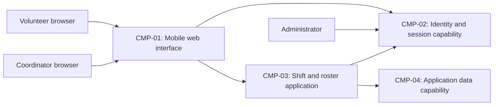

# ARCH-001 — Volunteer shift sign-up for the Riverside Food Bank architecture

## 1. Context and scope

Defined against PRD-001 version 1, status approved, owned by Priya Nair. The
system lets approximately 120 volunteers sign in and book warehouse shifts from
mobile web browsers, and lets the coordinator view daily rosters. Session
revocation and restricted access to volunteer phone numbers are within scope.
Payroll, donations and an installed mobile app are outside scope.

The request explicitly selected PRD-001 and instructed proceeding without
questions. No inspection scope was named and no code or configuration was
inspected. The permitted specification paths contain no existing ARCH or policy
documents, and no local preferences were present. Create is the proposed outcome
because no ARCH covers this system; the request did not confirm that outcome.
All component boundaries and data allocations below are proposals awaiting the
associated decisions. No ADR is written and no architectural choice is accepted
by this draft.

## 2. Quality drivers

PRD-001#NFR-001 requires administrator-initiated revocation of a volunteer's
sessions to take effect within five minutes. Identity-provider selection and
revocation enforcement are separate questions: selecting a provider does not
prove the end-to-end revocation bound. The eventual design must account for
application sessions, token validity and validation caches on protected requests.

PRD-001#NFR-002 restricts phone-number visibility to the coordinator. Authoritative
profile ownership and server-side access enforcement must be shared across
booking and roster implementations; hiding a field in the browser is insufficient.
PRD-001#NFR-003 requires hosted services throughout the product because the food
bank has no on-site server. It does not select a provider or deployment topology.

The operating context is internal, as stated in the PRD; its Pilot release label
does not change that context. The framework floor comprises constraint, security
and privacy, covered respectively by PRD-001#NFR-003, PRD-001#NFR-001 and
PRD-001#NFR-002. No required category is missing and no policy adds categories.
ADR-001 records an accepted 30-day hosted application-log retention decision; it
does not settle identity or revocation. Existing implementation and compatibility
with that ADR remain unknown without inspection.

## 3. Components

This is a proposed logical decomposition, not a selection of vendors or separate
services. ARCH-001#DEC-04 leaves the boundaries open, ARCH-001#DEC-05 leaves
authoritative data ownership open, and ARCH-001#DEC-06 leaves the booking-to-roster
interaction open. Arrows show required collaborations, not chosen protocols.



```yaml items
components:
  - id: CMP-01
    status: active
    name: "Mobile web interface"
    responsibility: "Proposed shared browser interface for sign-in, booking and coordinator rosters; does not own durable records or enforce the final authorization boundary."
    owns_data: []
    interacts_with:
      - "CMP-02"
      - "CMP-03"
    deployment: "Open: see DEC-07"
    upstream:
      - {id: PRD-001, item: NFR-001, relation: informed_by, version: 1, hash: null}
      - {id: PRD-001, item: NFR-002, relation: informed_by, version: 1, hash: null}
      - {id: PRD-001, item: NFR-003, relation: informed_by, version: 1, hash: null}
  - id: CMP-02
    status: active
    name: "Identity and session capability"
    responsibility: "Proposed authentication and session lifecycle capability, including administrator revocation; provider and enforcement mechanism remain open and it does not own shift bookings."
    owns_data:
      - "Proposed authentication identities and session lifecycle records; allocation awaits DEC-01 and DEC-02."
    interacts_with:
      - "CMP-01"
      - "CMP-03"
      - "Administrator"
    deployment: "Open: see DEC-07"
    upstream:
      - {id: PRD-001, item: NFR-001, relation: informed_by, version: 1, hash: null}
      - {id: PRD-001, item: NFR-003, relation: informed_by, version: 1, hash: null}
  - id: CMP-03
    status: active
    name: "Shift and roster application"
    responsibility: "Proposed shared application boundary for booking, roster reads and coordinator authorization; validates sessions and uses authoritative application records, without owning credentials."
    owns_data: []
    interacts_with:
      - "CMP-01"
      - "CMP-02"
      - "CMP-04"
    deployment: "Open: see DEC-07"
    upstream:
      - {id: PRD-001, item: NFR-001, relation: informed_by, version: 1, hash: null}
      - {id: PRD-001, item: NFR-002, relation: informed_by, version: 1, hash: null}
      - {id: PRD-001, item: NFR-003, relation: informed_by, version: 1, hash: null}
  - id: CMP-04
    status: active
    name: "Application data capability"
    responsibility: "Proposed authoritative application record boundary supporting booking and roster views; does not own credentials and may be part of the application rather than a separate service."
    owns_data:
      - "Proposed volunteer profiles and phone numbers; ownership awaits DEC-05."
      - "Proposed warehouse shifts and bookings; ownership awaits DEC-05."
    interacts_with:
      - "CMP-03"
    deployment: "Open: see DEC-07"
    upstream:
      - {id: PRD-001, item: NFR-002, relation: informed_by, version: 1, hash: null}
      - {id: PRD-001, item: NFR-003, relation: informed_by, version: 1, hash: null}
```

## 4. Architectural questions

All questions remain blocking and open: no platform mandate applies and the user
requested no decision questions. Alternatives in notes are candidates for future
decisions, not accepted choices. Requirement links identify the behavior or quality
that depends on each answer; exact APIs, schemas and UI layouts belong in specs.

```yaml items
decisions:
  - id: DEC-01
    status: active
    question: "Which identity provider handles volunteer sign-in?"
    blocking: true
    state: open
    resolved_by: []
    notes: "Captures the PRD NEEDS ADR marker. A managed identity provider reduces credential operations; application-managed identity offers control but increases security work. Booking consumes the resulting authenticated identity and revocation must integrate with it. ADR-001 decides log retention only and cannot resolve this question. No option was selected."
    upstream:
      - {id: PRD-001, item: FR-001, relation: informed_by, version: 1, hash: null}
      - {id: PRD-001, item: FR-002, relation: informed_by, version: 1, hash: null}
      - {id: PRD-001, item: NFR-001, relation: informed_by, version: 1, hash: null}
  - id: DEC-02
    status: active
    question: "How will administrator revocation invalidate volunteer sessions on protected requests within five minutes?"
    blocking: true
    state: open
    resolved_by: []
    notes: "Independent of identity-provider selection. Central session validation can enforce revocation directly but adds a runtime dependency; bounded token lifetime with controlled renewal reduces lookups but must bound every cache and renewal path. Sign-in and signed-in booking share enforcement. No option was selected."
    upstream:
      - {id: PRD-001, item: FR-001, relation: informed_by, version: 1, hash: null}
      - {id: PRD-001, item: FR-002, relation: informed_by, version: 1, hash: null}
      - {id: PRD-001, item: NFR-001, relation: informed_by, version: 1, hash: null}
  - id: DEC-03
    status: active
    question: "Where will coordinator-only access to volunteer phone numbers be enforced?"
    blocking: true
    state: open
    resolved_by: []
    notes: "A shared application authorization boundary centralizes role checks; data-layer access policies move enforcement close to records but require consistent identity and role propagation. The decision must cover all record access and prevent alternate access paths, including booking responses, from exposing numbers. The roster is the coordinator-facing surface. No option was selected."
    upstream:
      - {id: PRD-001, item: FR-002, relation: informed_by, version: 1, hash: null}
      - {id: PRD-001, item: FR-003, relation: informed_by, version: 1, hash: null}
      - {id: PRD-001, item: NFR-002, relation: informed_by, version: 1, hash: null}
  - id: DEC-04
    status: active
    question: "What shared component boundaries divide authentication, booking, roster access and data responsibilities?"
    blocking: true
    state: open
    resolved_by: []
    notes: "The CMP decomposition is proposed. A modular application reduces operational coordination; independently operated services allow separate lifecycles but require explicit cross-service contracts and security boundaries. This answer determines where the product-wide hosted constraint and quality controls are implemented. No boundary choice was accepted."
    upstream:
      - {id: PRD-001, item: FR-001, relation: informed_by, version: 1, hash: null}
      - {id: PRD-001, item: FR-002, relation: informed_by, version: 1, hash: null}
      - {id: PRD-001, item: FR-003, relation: informed_by, version: 1, hash: null}
      - {id: PRD-001, item: NFR-001, relation: informed_by, version: 1, hash: null}
      - {id: PRD-001, item: NFR-002, relation: informed_by, version: 1, hash: null}
      - {id: PRD-001, item: NFR-003, relation: informed_by, version: 1, hash: null}
  - id: DEC-05
    status: active
    question: "Which component is authoritative for volunteer profiles, warehouse shifts and bookings?"
    blocking: true
    state: open
    resolved_by: []
    notes: "One application data owner simplifies consistent booking and roster reads; separate domain owners require contracts for identity references and permitted profile access. CMP-04 shows a candidate allocation only. Credential and session ownership remains separately tied to DEC-01 and DEC-02. No ownership choice was accepted."
    upstream:
      - {id: PRD-001, item: FR-002, relation: informed_by, version: 1, hash: null}
      - {id: PRD-001, item: FR-003, relation: informed_by, version: 1, hash: null}
      - {id: PRD-001, item: NFR-002, relation: informed_by, version: 1, hash: null}
  - id: DEC-06
    status: active
    question: "How will committed bookings become visible to the coordinator's daily roster?"
    blocking: true
    state: open
    resolved_by: []
    notes: "Reading the authoritative booking data through a shared application interface simplifies consistency; an event-fed roster projection permits independent reads but adds lag and reconciliation. The PRD describes a live roster without a numerical freshness target, so none is invented here. Exact API fields remain for specs. No interaction choice was accepted."
    upstream:
      - {id: PRD-001, item: FR-002, relation: informed_by, version: 1, hash: null}
      - {id: PRD-001, item: FR-003, relation: informed_by, version: 1, hash: null}
  - id: DEC-07
    status: active
    question: "Which hosted deployment topology will run the complete product?"
    blocking: true
    state: open
    resolved_by: []
    notes: "The hosted-only constraint is given, but providers, deployment units and environment boundaries remain undecided. A managed application platform can reduce operations; separately managed hosted units offer isolation with more configuration and coordination. Hosting spans every feature and the execution of session and privacy controls. ADR-001 names a hosting provider's log service generically and selects no provider or topology."
    upstream:
      - {id: PRD-001, item: FR-001, relation: informed_by, version: 1, hash: null}
      - {id: PRD-001, item: FR-002, relation: informed_by, version: 1, hash: null}
      - {id: PRD-001, item: FR-003, relation: informed_by, version: 1, hash: null}
      - {id: PRD-001, item: NFR-001, relation: informed_by, version: 1, hash: null}
      - {id: PRD-001, item: NFR-002, relation: informed_by, version: 1, hash: null}
      - {id: PRD-001, item: NFR-003, relation: informed_by, version: 1, hash: null}
```

## 5. Evidence inspected

```yaml items
evidence:
  - id: EVD-01
    status: active
    source: "PRD-001"
    kind: prd
    finding: "Version 1, status approved: requires volunteer sign-in and booking, coordinator daily rosters, five-minute session revocation, coordinator-only phone visibility and hosted services for the whole product; explicitly leaves identity-provider selection as NEEDS ADR. Operating context is internal."
    classification: context
  - id: EVD-02
    status: active
    source: "ADR-001"
    kind: adr
    finding: "Version 1, status accepted (superseded_by null): retains application logs for 30 days in the hosting provider's log service and cites FR-001. It does not answer identity-provider selection, session revocation, privacy enforcement or hosted deployment topology. No user confirmation assigns this ADR to a DEC in this run."
    classification: decided
```

## 6. Deployment

PRD-001#NFR-003 applies to the whole product: the web interface, application,
identity/session capability and application data must use hosted services.
ARCH-001#DEC-07 leaves providers, deployable units and environment boundaries
open. Logical CMP items do not imply four independent deployments. No on-site
server is proposed. The pilot uses Tuesday and Thursday shifts before expanding,
as specified in the PRD; it does not itself prescribe separate environments.

Future verification must demonstrate revocation within five minutes across
protected paths, coordinator-only phone visibility across access paths, and that
every server-side deployment is hosted. ADR-001 supplies log-retention context
but neither establishes an existing deployment nor authorizes reuse.

## 7. Requirement changes proposed to the PRD owner

- None.

## 8. Open questions

- [NEEDS CLARIFICATION: No inspection scope was named and no code or configuration was inspected; existing components, deployed services and implementation reuse suitability are unknown.]
- [NEEDS CLARIFICATION: The create outcome is proposed because no ARCH covers this system; the user has not explicitly confirmed the outcome.]
- [NEEDS CLARIFICATION: Priya Nair should clarify the intended freshness of the live roster in PRD-001; this product clarification is not a separate architectural decision or an invented performance requirement.]
- [NEEDS CLARIFICATION: host model/session identity unavailable]

## Change Log

| Version | Date | Author | Change | Items affected |
|---|---|---|---|---|
| 1 | 2026-09-28 | codex (session unknown) | Initial draft for PRD-001 v1. Policy resolution: interview.max_calls=8 (default); architecture.mandated_platforms=none (default); quality.required_categories=floor only (default) | all |
| 1 | 2026-09-28 | codex (session unknown) | Validation incomplete: self-check 3 (BEH-13 and VER-14) cannot verify host model/session identity. Retained as draft with empty approval fields, open decisions and unconfirmed outcome; no prior content required restoration. Readiness handoff withheld under ERR-05. Policy resolution: interview.max_calls=8 (default); architecture.mandated_platforms=none (default); quality.required_categories=floor only (default) | generated_by |
