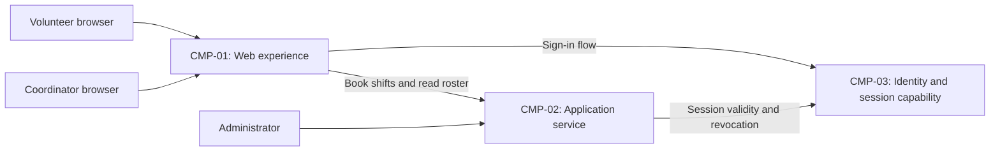

# ARCH-001 — Volunteer shift sign-up for the Riverside Food Bank architecture

## 1. Context and scope

Defined against PRD-001 version 1, status approved, owned by Priya Nair. The
system lets about 120 volunteers sign in and book warehouse shifts through
mobile-first web pages, and lets the coordinator view each day's roster.
Session revocation, coordinator-only access to volunteer phone numbers, and
hosted operation are in scope. Payroll, donations, and an installed mobile app
are outside the product scope.

The request explicitly selects PRD-001 and says to proceed without questions.
No inspection scope was named and no code or configuration was inspected.
No existing ARCH, ADR, policy document, or local preference file was found at
the contract paths. Framework defaults therefore apply. No implementation or
reusable platform is established by the evidence.

A new ARCH is proposed because none covers this system. Creation as an outcome
has not been explicitly confirmed, so outcome remains null. The components
below are a proposed logical shape; their boundaries, ownership, interactions,
and deployment choices remain open. No ADR is written and no architectural
choice is accepted through this draft.

## 2. Quality drivers

PRD-001#NFR-001 requires an administrator to revoke a volunteer's signed-in
sessions so they stop working within five minutes. Sign-in and the signed-in
booking path must share an enforceable session validity contract; choosing an
identity provider alone does not establish this guarantee.

PRD-001#NFR-002 limits visibility of volunteer phone numbers to the coordinator.
The proposed application service owns the access checks before data reaches
the browser. Its authority for coordinator and administrator roles, ownership
of contact data, and enforcement mechanism are still choices to settle.
Administrator session-revocation privileges do not imply permission to see
phone numbers.

PRD-001#NFR-003 requires hosted services across the whole product because there
is no on-site server. It constrains every component without selecting a
provider, deployment topology, or persistence service.

The operating context is internal, as stated in PRD-001. The Pilot release
label does not override it. The required quality floor is constraint, security,
and privacy; all three categories have NFR coverage. No policy adds categories.
No additional availability or performance target is assumed.

## 3. Components

The diagram shows proposed logical responsibilities, not accepted deployment
units. ARCH-001#DEC-03 covers their boundaries; ARCH-001#DEC-04 covers application
data ownership; ARCH-001#DEC-06 covers booking-to-roster interactions.



```yaml items
components:
  - id: CMP-01
    status: active
    name: "Web experience"
    responsibility: "Proposed mobile-first sign-in, booking, and coordinator roster interface; does not own authoritative records or make trusted access decisions."
    owns_data: []
    interacts_with:
      - "CMP-02"
      - "CMP-03"
    deployment: "Open: see DEC-07"
    upstream:
      - {id: PRD-001, item: NFR-001, relation: informed_by, version: 1, hash: null}
      - {id: PRD-001, item: NFR-002, relation: informed_by, version: 1, hash: null}
      - {id: PRD-001, item: NFR-003, relation: informed_by, version: 1, hash: null}
  - id: CMP-02
    status: active
    name: "Application service"
    responsibility: "Proposed authority for booking, roster reads, role-based access, and the administrator revocation entry point; delegates authentication and session lifecycle to CMP-03 and does not own credentials."
    owns_data:
      - "Proposed under DEC-04: volunteer profiles, phone numbers, and application identity mappings"
      - "Proposed under DEC-04: warehouse shifts and bookings"
      - "Proposed under DEC-05: coordinator and administrator role assignments"
    interacts_with:
      - "CMP-01"
      - "CMP-03"
    deployment: "Open: see DEC-07"
    upstream:
      - {id: PRD-001, item: NFR-001, relation: informed_by, version: 1, hash: null}
      - {id: PRD-001, item: NFR-002, relation: informed_by, version: 1, hash: null}
      - {id: PRD-001, item: NFR-003, relation: informed_by, version: 1, hash: null}
  - id: CMP-03
    status: active
    name: "Identity and session capability"
    responsibility: "Proposed authentication and session issuance, validation, and revocation capability; does not own shifts, bookings, or volunteer phone numbers. Provider and session mechanism remain separate open decisions."
    owns_data:
      - "Proposed under DEC-01: authentication identities and credentials"
      - "Proposed under DEC-02: signed-in session and revocation state"
    interacts_with:
      - "CMP-01"
      - "CMP-02"
    deployment: "Open: see DEC-07"
    upstream:
      - {id: PRD-001, item: NFR-001, relation: informed_by, version: 1, hash: null}
      - {id: PRD-001, item: NFR-002, relation: informed_by, version: 1, hash: null}
      - {id: PRD-001, item: NFR-003, relation: informed_by, version: 1, hash: null}
```

## 4. Architectural questions

All questions remain blocking and open. There is no mandated platform or
explicit decision that can resolve them. Notes describe alternatives for
later consideration without selecting them.

```yaml items
decisions:
  - id: DEC-01
    status: active
    question: "Which identity provider handles volunteer sign-in?"
    blocking: true
    state: open
    resolved_by: []
    notes: "From the PRD NEEDS ADR marker. FR-002 also consumes the authenticated identity. A hosted managed provider reduces identity operations; an application-owned identity capability offers control but adds credential operations. No provider is selected. Session revocation is separately covered by DEC-02."
    upstream:
      - {id: PRD-001, item: FR-001, relation: informed_by, version: 1, hash: null}
      - {id: PRD-001, item: FR-002, relation: informed_by, version: 1, hash: null}
  - id: DEC-02
    status: active
    question: "How will administrator revocation make every affected volunteer session stop working within five minutes?"
    blocking: true
    state: open
    resolved_by: []
    notes: "Covers session issuance and validation on signed-in booking requests, including cached validity and refresh behavior. Central session validation provides direct revocation control with a runtime dependency; bounded token lifetimes require coordinated refresh denial and cache limits. Provider selection alone resolves neither approach."
    upstream:
      - {id: PRD-001, item: FR-001, relation: informed_by, version: 1, hash: null}
      - {id: PRD-001, item: FR-002, relation: informed_by, version: 1, hash: null}
      - {id: PRD-001, item: NFR-001, relation: informed_by, version: 1, hash: null}
  - id: DEC-03
    status: active
    question: "What component boundaries separate web presentation, booking and roster behavior, and identity and session responsibilities?"
    blocking: true
    state: open
    resolved_by: []
    notes: "CMP-01 through CMP-03 are proposed logical boundaries. A single application with internal modules simplifies coordination; separate services allow independent operation but add integration contracts. The split determines where session and privacy checks must be enforced across all three functional requirements."
    upstream:
      - {id: PRD-001, item: FR-001, relation: informed_by, version: 1, hash: null}
      - {id: PRD-001, item: FR-002, relation: informed_by, version: 1, hash: null}
      - {id: PRD-001, item: FR-003, relation: informed_by, version: 1, hash: null}
      - {id: PRD-001, item: NFR-001, relation: informed_by, version: 1, hash: null}
      - {id: PRD-001, item: NFR-002, relation: informed_by, version: 1, hash: null}
  - id: DEC-04
    status: active
    question: "Which component is authoritative for volunteer profiles and identity mappings, phone numbers, shifts, and bookings?"
    blocking: true
    state: open
    resolved_by: []
    notes: "CMP-02 is a proposed owner. A single application data authority simplifies mapping sign-in identities to bookings and roster records; split domain ownership requires shared identity and read contracts. Contact data ownership must support coordinator-only disclosure. No storage schema is specified."
    upstream:
      - {id: PRD-001, item: FR-001, relation: informed_by, version: 1, hash: null}
      - {id: PRD-001, item: FR-002, relation: informed_by, version: 1, hash: null}
      - {id: PRD-001, item: FR-003, relation: informed_by, version: 1, hash: null}
      - {id: PRD-001, item: NFR-002, relation: informed_by, version: 1, hash: null}
  - id: DEC-05
    status: active
    question: "What shared authorization authority enforces volunteer, coordinator, and administrator access across the system?"
    blocking: true
    state: open
    resolved_by: []
    notes: "Application-owned role checks centralize control but require role administration; provider-issued roles reduce application role storage but need freshness and enforcement contracts. Sign-in establishes the access context, booking requires signed-in access, roster and phone disclosure require coordinator access, and session revocation requires administrator access. Phone numbers must be filtered before browser delivery, including identity responses if they contain contact data."
    upstream:
      - {id: PRD-001, item: FR-001, relation: informed_by, version: 1, hash: null}
      - {id: PRD-001, item: FR-002, relation: informed_by, version: 1, hash: null}
      - {id: PRD-001, item: FR-003, relation: informed_by, version: 1, hash: null}
      - {id: PRD-001, item: NFR-001, relation: informed_by, version: 1, hash: null}
      - {id: PRD-001, item: NFR-002, relation: informed_by, version: 1, hash: null}
  - id: DEC-06
    status: active
    question: "How do accepted bookings become visible in the coordinator roster?"
    blocking: true
    state: open
    resolved_by: []
    notes: "Reading the authoritative booking state couples roster reads to booking storage but avoids a separate projection; publishing booking events decouples reads but adds delivery, reconciliation, and freshness obligations. Both must support the PRD live-roster intent. No numerical freshness target is invented."
    upstream:
      - {id: PRD-001, item: FR-002, relation: informed_by, version: 1, hash: null}
      - {id: PRD-001, item: FR-003, relation: informed_by, version: 1, hash: null}
  - id: DEC-07
    status: active
    question: "What hosted deployment topology will run the whole product?"
    blocking: true
    state: open
    resolved_by: []
    notes: "NFR-003 rules out on-site servers without selecting services or deployment units. A managed application platform simplifies runtime operations; separately hosted application, identity, and persistence services allow independent choices but add operating responsibilities. This covers all functional requirements and the hosted session and privacy enforcement paths. Environments and runtime locations remain unselected."
    upstream:
      - {id: PRD-001, item: FR-001, relation: informed_by, version: 1, hash: null}
      - {id: PRD-001, item: FR-002, relation: informed_by, version: 1, hash: null}
      - {id: PRD-001, item: FR-003, relation: informed_by, version: 1, hash: null}
      - {id: PRD-001, item: NFR-001, relation: informed_by, version: 1, hash: null}
      - {id: PRD-001, item: NFR-002, relation: informed_by, version: 1, hash: null}
      - {id: PRD-001, item: NFR-003, relation: informed_by, version: 1, hash: null}
```

## 5. Evidence inspected

```yaml items
evidence:
  - id: EVD-01
    status: active
    source: "PRD-001"
    kind: prd
    finding: "Version 1, status approved: requires volunteer sign-in and booking, a coordinator roster, five-minute session revocation, coordinator-only phone visibility, and hosted services across the whole product. The identity provider is explicitly marked NEEDS ADR. Operating context is internal."
    classification: context
```

## 6. Deployment

Hosted services are required by PRD-001#NFR-003 for the whole product. The
browser experience needs hosted delivery, and the application, identity/session
capability, and persistent records need hosted execution or storage. No
provider, runtime, data store, region, or environment layout has been selected.
ARCH-001#DEC-07 leaves these deployment units open; the three logical components
do not assert three separately deployed services. The Tuesday/Thursday pilot
rollout does not establish a separate deployment environment.

## 7. Requirement changes proposed to the PRD owner

- None.

## 8. Open questions

- [NEEDS CLARIFICATION: No inspection scope was named and no code or configuration was inspected; existing implementation, reusable services, and operating capabilities are unknown.]
- [NEEDS CLARIFICATION: host model/session identity unavailable]
- [NEEDS CLARIFICATION: The create outcome for ARCH-001 has not been explicitly confirmed; the request to define architecture does not confirm this outcome.]

## Change Log

| Version | Date | Author | Change | Items affected |
|---|---|---|---|---|
| 1 | 2026-09-28 | codex (session unknown) | Initial draft for PRD-001 v1; proposed components and seven open blocking questions, with no ADRs. Policy resolution: interview.max_calls=8 (default); architecture.mandated_platforms=none (default); quality.required_categories=floor only (default) | all |
| 1 | 2026-09-28 | codex (session unknown) | Validation audit: self-check 3 remains unresolved because exact host model and session identities are unavailable. Retained as draft with empty approval fields, null outcome, and every DEC open; no accepted ADR or prior approval required restoration. Readiness handoff withheld under ERR-05. Policy resolution: interview.max_calls=8 (default); architecture.mandated_platforms=none (default); quality.required_categories=floor only (default) | generated_by |
