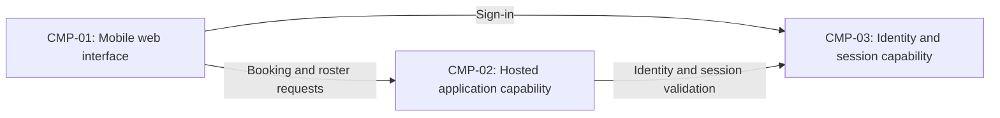

# ARCH-001 — Volunteer shift sign-up for the Riverside Food Bank architecture

## 1. Context and scope

This proposal examines PRD-001 version 1, whose frontmatter status is draft. Its change log says
Approved, but that does not override the frontmatter; the PRD may still change. Priya Nair owns
that discrepancy. The system supports about 120 volunteers booking warehouse shifts through mobile
web pages and a coordinator viewing each day's roster. Payroll and donations are out of scope.

The user selected PRD-001 and requested proceeding without questions. No inspection scope was
named, and no code or configuration was inspected. No existing ARCH, ADR, policy document or local
preference was found at the contract paths. Create is the proposed outcome because no ARCH covers
this system; it is unconfirmed, so outcome remains null. The proposed components do not constitute
accepted decisions. No ADR is authorized by this no-questions run.

## 2. Quality drivers

PRD-001#NFR-001 requires administrative revocation to stop volunteer sessions within five minutes.
It governs both sign-in and subsequent authenticated booking, with separate provider and revocation
questions in ARCH-001#DEC-01 and ARCH-001#DEC-02. Verification in later implementation must exercise
all session and refresh paths, including already-issued sessions.

PRD-001#NFR-002 limits phone-number visibility to the coordinator. Contact ownership and trusted
access enforcement must be shared across roster and identity integration; these are separate
questions in ARCH-001#DEC-03 and ARCH-001#DEC-07. Later verification must show that unauthorized
callers cannot retrieve phone numbers through application or storage interfaces.

PRD-001#NFR-003 requires hosted services for the entire product because there is no on-site server.
ARCH-001#DEC-04 therefore cites every functional and non-functional requirement. Hosted deployment
is a requirement, while topology and provider selection remain undecided.

The operating context is internal, as explicitly stated in PRD-001, despite the Pilot release label.
The framework floor is constraint, security and privacy; all three have NFRs. There are no missing
required categories and no mandated platforms. The stated user population supports evaluating a
small deployment but establishes no throughput or availability target.

## 3. Components

The following logical shape is proposed, pending ARCH-001#DEC-05. Arrows show required interactions,
not accepted protocols or deployment units. Proposed data ownership remains subject to
ARCH-001#DEC-06 and ARCH-001#DEC-07; session ownership remains subject to ARCH-001#DEC-02.



```yaml items
components:
  - id: CMP-01
    status: active
    name: "Volunteer and coordinator browser interface"
    responsibility: "Proposed mobile web interface for sign-in, booking and daily roster views; the browser is not the authority for sessions, bookings or contact access."
    owns_data: []
    interacts_with:
      - "CMP-02"
      - "CMP-03"
    deployment: "Open: see DEC-04"
    upstream:
      - {id: PRD-001, item: NFR-001, relation: informed_by, version: 1, hash: null}
      - {id: PRD-001, item: NFR-002, relation: informed_by, version: 1, hash: null}
      - {id: PRD-001, item: NFR-003, relation: informed_by, version: 1, hash: null}
  - id: CMP-02
    status: active
    name: "Hosted application capability"
    responsibility: "Proposed application boundary for booking, roster queries, session checks and authorized contact access; it does not issue identity credentials. Logical modules versus separate services remain open in DEC-05."
    owns_data:
      - "Proposed authoritative shift definitions and bookings, pending DEC-06"
      - "Proposed volunteer contact records and identity references, pending DEC-07"
    interacts_with:
      - "CMP-01"
      - "CMP-03"
    deployment: "Open: see DEC-04"
    upstream:
      - {id: PRD-001, item: NFR-001, relation: informed_by, version: 1, hash: null}
      - {id: PRD-001, item: NFR-002, relation: informed_by, version: 1, hash: null}
      - {id: PRD-001, item: NFR-003, relation: informed_by, version: 1, hash: null}
  - id: CMP-03
    status: active
    name: "Identity and session capability"
    responsibility: "Proposed authority for authenticating volunteers and supporting administrative session revocation; it does not own shift bookings. Provider and application session responsibilities remain open in DEC-01 and DEC-02."
    owns_data:
      - "Proposed credentials and identity subjects, pending DEC-01"
      - "Proposed session and revocation state, pending DEC-02"
    interacts_with:
      - "CMP-01"
      - "CMP-02"
    deployment: "Open: see DEC-04"
    upstream:
      - {id: PRD-001, item: NFR-001, relation: informed_by, version: 1, hash: null}
      - {id: PRD-001, item: NFR-003, relation: informed_by, version: 1, hash: null}
```

## 4. Architectural questions

All questions remain blocking and open. No approved mandate resolves them, and the request
authorizes no decision interview. Options below describe trade-offs without selecting a design.

```yaml items
decisions:
  - id: DEC-01
    status: active
    question: "Which identity provider supplies volunteer sign-in?"
    blocking: true
    state: open
    resolved_by: []
    notes: "Captures the PRD NEEDS ADR marker. A hosted identity provider reduces credential operations; application-managed identity gives more control but adds security maintenance. Booking consumes the authenticated identity and revocation depends on provider capabilities. No option is accepted."
    upstream:
      - {id: PRD-001, item: FR-001, relation: informed_by, version: 1, hash: null}
      - {id: PRD-001, item: FR-002, relation: informed_by, version: 1, hash: null}
      - {id: PRD-001, item: NFR-001, relation: informed_by, version: 1, hash: null}
  - id: DEC-02
    status: active
    question: "How will administrative revocation invalidate every volunteer session within five minutes?"
    blocking: true
    state: open
    resolved_by: []
    notes: "Central session validation can propagate revocation promptly but adds a runtime dependency; bounded token lifetimes with refresh denial reduce lookups but require a verified worst-case five-minute bound. Include application sessions and refresh paths, not only provider sign-out. No option is accepted."
    upstream:
      - {id: PRD-001, item: FR-001, relation: informed_by, version: 1, hash: null}
      - {id: PRD-001, item: FR-002, relation: informed_by, version: 1, hash: null}
      - {id: PRD-001, item: NFR-001, relation: informed_by, version: 1, hash: null}
  - id: DEC-03
    status: active
    question: "Where is coordinator-only access to volunteer phone numbers authoritatively enforced?"
    blocking: true
    state: open
    resolved_by: []
    notes: "Application-side authorization offers a single controlled contact interface; data-platform access rules can enforce access closer to storage but require consistent role mapping. Browser-only hiding cannot meet the requirement. Coordinator and administrator roles must not be assumed equivalent. No option is accepted."
    upstream:
      - {id: PRD-001, item: FR-003, relation: informed_by, version: 1, hash: null}
      - {id: PRD-001, item: NFR-002, relation: informed_by, version: 1, hash: null}
  - id: DEC-04
    status: active
    question: "What hosted deployment topology will run the whole product?"
    blocking: true
    state: open
    resolved_by: []
    notes: "Hosted operation is required by NFR-003, but provider and deployment topology are undecided. A managed application with managed persistence reduces operations; independently hosted functions and services allow separate scaling but add integration and security boundaries. Covers the entire product, including identity, contact storage and session enforcement. No option is accepted."
    upstream:
      - {id: PRD-001, item: FR-001, relation: informed_by, version: 1, hash: null}
      - {id: PRD-001, item: FR-002, relation: informed_by, version: 1, hash: null}
      - {id: PRD-001, item: FR-003, relation: informed_by, version: 1, hash: null}
      - {id: PRD-001, item: NFR-001, relation: informed_by, version: 1, hash: null}
      - {id: PRD-001, item: NFR-002, relation: informed_by, version: 1, hash: null}
      - {id: PRD-001, item: NFR-003, relation: informed_by, version: 1, hash: null}
  - id: DEC-05
    status: active
    question: "What shared component boundaries divide the web interface, booking and roster application, and identity/session responsibilities?"
    blocking: true
    state: open
    resolved_by: []
    notes: "The diagram is a proposal. One application with logical modules limits coordination overhead for the stated user population; separate booking, roster and identity adapters allow independent delivery but require explicit interfaces and distributed authorization. This boundary choice affects every capability, both quality controls and hosted deployment. No option is accepted."
    upstream:
      - {id: PRD-001, item: FR-001, relation: informed_by, version: 1, hash: null}
      - {id: PRD-001, item: FR-002, relation: informed_by, version: 1, hash: null}
      - {id: PRD-001, item: FR-003, relation: informed_by, version: 1, hash: null}
      - {id: PRD-001, item: NFR-001, relation: informed_by, version: 1, hash: null}
      - {id: PRD-001, item: NFR-002, relation: informed_by, version: 1, hash: null}
      - {id: PRD-001, item: NFR-003, relation: informed_by, version: 1, hash: null}
  - id: DEC-06
    status: active
    question: "Which component owns the authoritative shift and booking records used by booking and roster views?"
    blocking: true
    state: open
    resolved_by: []
    notes: "One application-owned transactional source simplifies agreement on open shifts and booked volunteers; a separate scheduling service isolates ownership but requires both consumers to use its contract. Concurrent booking must respect the meaning of an open shift; the PRD owner retains authority over capacity rules. No option is accepted."
    upstream:
      - {id: PRD-001, item: FR-002, relation: informed_by, version: 1, hash: null}
      - {id: PRD-001, item: FR-003, relation: informed_by, version: 1, hash: null}
  - id: DEC-07
    status: active
    question: "Which component owns volunteer contact records and their mapping to identities?"
    blocking: true
    state: open
    resolved_by: []
    notes: "Application-owned contact records permit isolation from credential data; identity-profile ownership reduces duplication but must support coordinator-only disclosure and controlled synchronization. Phone numbers must not be assumed safe in general identity claims. No option is accepted."
    upstream:
      - {id: PRD-001, item: FR-003, relation: informed_by, version: 1, hash: null}
      - {id: PRD-001, item: NFR-002, relation: informed_by, version: 1, hash: null}
  - id: DEC-08
    status: active
    question: "How do successful bookings become visible in the coordinator roster?"
    blocking: true
    state: open
    resolved_by: []
    notes: "Reading the authoritative booking source avoids a second consistency boundary; an event-fed roster projection separates read concerns but introduces delay and recovery requirements. The summary describes a live roster without a numerical freshness target; that product target remains for the PRD owner. No option is accepted."
    upstream:
      - {id: PRD-001, item: FR-002, relation: informed_by, version: 1, hash: null}
      - {id: PRD-001, item: FR-003, relation: informed_by, version: 1, hash: null}
```

## 5. Evidence inspected

```yaml items
evidence:
  - id: EVD-01
    status: active
    source: "PRD-001"
    kind: prd
    finding: "Version 1, status draft: FR-001 through FR-003 define volunteer sign-in, booking and daily coordinator rosters; NFR-001 through NFR-003 require five-minute session revocation, coordinator-only phone visibility and hosted services for the whole product. The identity provider is a NEEDS ADR marker. The change log says Approved, conflicting with frontmatter status."
    classification: context
```

## 6. Deployment

All server-side capabilities and persistent state must run on hosted services under PRD-001#NFR-003;
volunteers and the coordinator use mobile-capable browsers. Provider, deployment units, persistence
service, environments and operational ownership remain open under ARCH-001#DEC-04. The diagram's
three logical capabilities are not a commitment to three services or three deployments.
No existing deployment was inspected, and reuse suitability is unknown.

## 7. Requirement changes proposed to the PRD owner

- None.

## 8. Open questions

- [NEEDS CLARIFICATION: No inspection scope was named and no code or configuration was inspected; existing identity, session, data and deployment capabilities and their reuse suitability are unknown.]
- [NEEDS CLARIFICATION: Priya Nair must reconcile PRD-001 frontmatter status draft with the Approved change-log entry; this proposal uses draft.]
- [NEEDS CLARIFICATION: PRD-001#FR-003 and the summary do not quantify live roster freshness; Priya Nair owns that product target, which informs ARCH-001#DEC-08.]
- [NEEDS CLARIFICATION: The user has not confirmed the proposed create outcome; outcome remains null.]
- [NEEDS CLARIFICATION: host model/session identity unavailable]

The host exposes the session/thread ID recorded above but does not expose an exact model ID.
The model value remains unknown; output-rule self-check 3 and provenance validation remain unresolved.
Architectural questions ARCH-001#DEC-01 through ARCH-001#DEC-08 remain open independently of this
metadata gap. The PRD and all other existing project documents are unchanged.

## Change Log

| Version | Date | Author | Change | Items affected |
|---|---|---|---|---|
| 1 | 2026-09-28 | codex (session 01a0e9eb-2827-7a52-ae86-d8545dabee60) | Initial draft for PRD-001 v1. Policy resolution: interview.max_calls=8 (default); architecture.mandated_platforms=none (default); quality.required_categories=floor only (default) | all |
| 1 | 2026-09-28 | codex (session 01a0e9eb-2827-7a52-ae86-d8545dabee60) | Validation incomplete (ERR-05): exact host model ID unavailable; self-check 3 remains unresolved. Retained draft with empty approval fields, outcome null and all decisions open; no status, approval or resolver restoration was necessary, and no ADR was written. Readiness handoff withheld. Policy resolution: interview.max_calls=8 (default); architecture.mandated_platforms=none (default); quality.required_categories=floor only (default) | generated_by |
