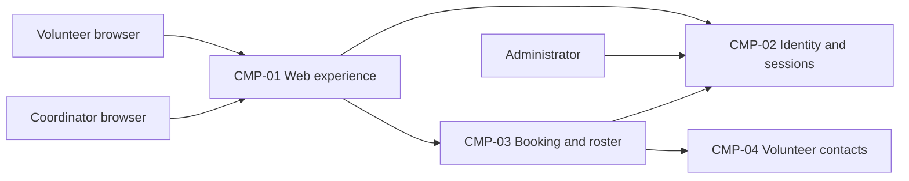

# ARCH-001 — Volunteer shift sign-up for the Riverside Food Bank architecture

## 1. Context and scope

This proposal describes volunteer sign-in, warehouse shift booking, and a coordinator's daily roster for approximately 120 volunteers. It is based on PRD-001 version 1, whose frontmatter status is draft. Its change log says Approved, but the frontmatter remains authoritative for this run; the proposal may change with the PRD. Payroll and donations are outside scope. The experience is mobile-first web pages without an installed app.

The request explicitly selected PRD-001 and said to proceed without questions. No inspection scope was named and no code or configuration was inspected. The contract paths contain no existing ARCH, ADR, or policy documents; the local preference file is absent. A new ARCH is proposed because none covers the system. The request did not confirm the create outcome, so outcome remains null. No architectural choice is accepted and no ADR is written.

## 2. Quality drivers

PRD-001#NFR-001 requires administrator revocation of volunteer sessions to take effect within five minutes. Selecting an identity provider alone does not establish this guarantee; issuance, revocation and every protected volunteer operation must use a compatible enforcement mechanism.

PRD-001#NFR-002 restricts visibility of volunteer phone numbers to the coordinator. The contact-data owner and enforcement boundary must agree across the roster and booking capabilities. Browser rendering alone cannot establish the access restriction.

PRD-001#NFR-003 requires hosted services for the entire product because the food bank has no on-site server. It fixes the hosting constraint, but leaves provider selection and deployment units open.

The PRD's operating_context is internal, despite the release being called Pilot. The framework floor is constraint, security and privacy, covered by PRD-001#NFR-003, PRD-001#NFR-001 and PRD-001#NFR-002 respectively. No required quality category is missing. No approved policy adds categories or mandates a platform. The interview budget defaults to eight calls; zero calls were made as requested.

## 3. Components

The diagram shows proposed logical responsibilities and interactions, not accepted service boundaries or deployment units. ARCH-001#DEC-03 holds the boundary choice open; ARCH-001#DEC-04 and ARCH-001#DEC-05 hold data ownership open. Arrows represent capability interactions, not selected protocols.



```yaml items
components:
  - id: CMP-01
    status: active
    name: "Web experience"
    responsibility: "Proposed browser experience for sign-in, shift booking and daily rosters; does not own authoritative records or enforce server access policy alone."
    owns_data: []
    interacts_with:
      - "CMP-02"
      - "CMP-03"
    deployment: "Open: see DEC-08"
    upstream:
      - {id: PRD-001, item: NFR-002, relation: informed_by, version: 1, hash: null}
      - {id: PRD-001, item: NFR-003, relation: informed_by, version: 1, hash: null}
  - id: CMP-02
    status: active
    name: "Identity and sessions"
    responsibility: "Proposed authentication, session issuance and administrator revocation capability; does not own shift bookings. Provider and enforcement approach remain open."
    owns_data:
      - "Proposed ownership of authentication identities and session revocation state; subject to DEC-01, DEC-02 and DEC-03."
    interacts_with:
      - "CMP-01"
      - "CMP-03"
    deployment: "Open: see DEC-08"
    upstream:
      - {id: PRD-001, item: NFR-001, relation: informed_by, version: 1, hash: null}
      - {id: PRD-001, item: NFR-003, relation: informed_by, version: 1, hash: null}
  - id: CMP-03
    status: active
    name: "Booking and roster"
    responsibility: "Proposed authoritative shift booking and coordinator roster capability, including protected operations; does not own credentials or volunteer phone numbers."
    owns_data:
      - "Proposed ownership of open shifts and bookings shared by booking and roster views; subject to DEC-04."
    interacts_with:
      - "CMP-01"
      - "CMP-02"
      - "CMP-04"
    deployment: "Open: see DEC-08"
    upstream:
      - {id: PRD-001, item: NFR-001, relation: informed_by, version: 1, hash: null}
      - {id: PRD-001, item: NFR-002, relation: informed_by, version: 1, hash: null}
      - {id: PRD-001, item: NFR-003, relation: informed_by, version: 1, hash: null}
  - id: CMP-04
    status: active
    name: "Volunteer contacts"
    responsibility: "Proposed owner of volunteer contact records with coordinator-only phone-number access; does not own credentials, sessions or bookings."
    owns_data:
      - "Proposed ownership of volunteer contact records and phone numbers; subject to DEC-05."
    interacts_with:
      - "CMP-03"
    deployment: "Open: see DEC-08"
    upstream:
      - {id: PRD-001, item: NFR-002, relation: informed_by, version: 1, hash: null}
      - {id: PRD-001, item: NFR-003, relation: informed_by, version: 1, hash: null}
```

## 4. Architectural questions

Each question is blocking and unanswered. Suggested logical responsibilities above do not resolve these choices. Requirement links include the functional behavior governed by each quality decision. Detailed schemas, API fields and UI layouts remain for downstream specifications.

```yaml items
decisions:
  - id: DEC-01
    status: active
    question: "Which identity provider handles volunteer sign-in?"
    blocking: true
    state: open
    resolved_by: []
    notes: "Captures the PRD NEEDS ADR marker. Provider compatibility affects authenticated booking and session revocation, but does not settle the separate revocation mechanism. No mandated platform or explicit decision exists."
    upstream:
      - {id: PRD-001, item: FR-001, relation: informed_by, version: 1, hash: null}
      - {id: PRD-001, item: FR-002, relation: informed_by, version: 1, hash: null}
      - {id: PRD-001, item: NFR-001, relation: informed_by, version: 1, hash: null}
  - id: DEC-02
    status: active
    question: "How will administrator revocation make all of a volunteer's signed-in sessions stop working within five minutes?"
    blocking: true
    state: open
    resolved_by: []
    notes: "The identity and protected booking capabilities must agree on revocation state and enforcement timing. No session design has been selected or verified."
    upstream:
      - {id: PRD-001, item: FR-001, relation: informed_by, version: 1, hash: null}
      - {id: PRD-001, item: FR-002, relation: informed_by, version: 1, hash: null}
      - {id: PRD-001, item: NFR-001, relation: informed_by, version: 1, hash: null}
  - id: DEC-03
    status: active
    question: "What component boundaries separate the web experience, identity, booking and roster, and contact responsibilities?"
    blocking: true
    state: open
    resolved_by: []
    notes: "CMP-01 through CMP-04 are proposed logical responsibilities. Whether these are modules or independently operated services remains undecided, including the session and contact-data enforcement boundaries."
    upstream:
      - {id: PRD-001, item: FR-001, relation: informed_by, version: 1, hash: null}
      - {id: PRD-001, item: FR-002, relation: informed_by, version: 1, hash: null}
      - {id: PRD-001, item: FR-003, relation: informed_by, version: 1, hash: null}
      - {id: PRD-001, item: NFR-001, relation: informed_by, version: 1, hash: null}
      - {id: PRD-001, item: NFR-002, relation: informed_by, version: 1, hash: null}
  - id: DEC-04
    status: active
    question: "Which component owns authoritative shift availability and booking records used by both booking and daily rosters?"
    blocking: true
    state: open
    resolved_by: []
    notes: "CMP-03 is a proposal. Independent booking and roster epics need a common data authority; exact tables and transaction details belong in specifications."
    upstream:
      - {id: PRD-001, item: FR-002, relation: informed_by, version: 1, hash: null}
      - {id: PRD-001, item: FR-003, relation: informed_by, version: 1, hash: null}
  - id: DEC-05
    status: active
    question: "Which component owns volunteer contact records and their association with volunteers in the roster?"
    blocking: true
    state: open
    resolved_by: []
    notes: "CMP-04 is proposed. Contact ownership must support identifying roster volunteers while keeping phone-number access restricted; phone display on the roster is not assumed to be a product requirement."
    upstream:
      - {id: PRD-001, item: FR-003, relation: informed_by, version: 1, hash: null}
      - {id: PRD-001, item: NFR-002, relation: informed_by, version: 1, hash: null}
  - id: DEC-06
    status: active
    question: "How will the shared authorization boundary establish and enforce volunteer, coordinator and administrator permissions?"
    blocking: true
    state: open
    resolved_by: []
    notes: "Booking requires a signed-in volunteer; roster access and phone-number visibility depend on coordinator authority; revocation depends on administrator authority. Authentication provider selection alone does not define these permissions."
    upstream:
      - {id: PRD-001, item: FR-002, relation: informed_by, version: 1, hash: null}
      - {id: PRD-001, item: FR-003, relation: informed_by, version: 1, hash: null}
      - {id: PRD-001, item: NFR-001, relation: informed_by, version: 1, hash: null}
      - {id: PRD-001, item: NFR-002, relation: informed_by, version: 1, hash: null}
  - id: DEC-07
    status: active
    question: "How will confirmed bookings become visible to the coordinator's roster across the shared component interface?"
    blocking: true
    state: open
    resolved_by: []
    notes: "Booking and roster epics must agree on their interaction and consistency model. The PRD summary calls the roster live but provides no measurable freshness target; that product clarification remains with the PRD owner."
    upstream:
      - {id: PRD-001, item: FR-002, relation: informed_by, version: 1, hash: null}
      - {id: PRD-001, item: FR-003, relation: informed_by, version: 1, hash: null}
  - id: DEC-08
    status: active
    question: "Which hosted services and deployment units will run the whole product?"
    blocking: true
    state: open
    resolved_by: []
    notes: "NFR-003 applies to the whole product. All functional and quality requirements depend on the hosting arrangement; neither a provider nor a deployment topology is selected."
    upstream:
      - {id: PRD-001, item: FR-001, relation: informed_by, version: 1, hash: null}
      - {id: PRD-001, item: FR-002, relation: informed_by, version: 1, hash: null}
      - {id: PRD-001, item: FR-003, relation: informed_by, version: 1, hash: null}
      - {id: PRD-001, item: NFR-001, relation: informed_by, version: 1, hash: null}
      - {id: PRD-001, item: NFR-002, relation: informed_by, version: 1, hash: null}
      - {id: PRD-001, item: NFR-003, relation: informed_by, version: 1, hash: null}
```

## 5. Evidence inspected

```yaml items
evidence:
  - id: EVD-01
    status: active
    source: "PRD-001"
    kind: prd
    finding: "Version 1, status draft: FR-001 through FR-003 define sign-in, booking and daily rosters; NFR-001 requires revocation within five minutes, NFR-002 limits phone visibility to the coordinator, and NFR-003 requires hosted services for the whole product. Section 12 marks the identity provider NEEDS ADR. The change log says Approved while frontmatter remains draft."
    classification: context
```

## 6. Deployment

PRD-001#NFR-003 establishes hosted operation for all capabilities and persistent data. ARCH-001#DEC-08 leaves hosted service selection and deployment units open. No on-site server is proposed. The diagram's browser actors are client devices, not on-site servers. Runtime environments, operational ownership and deployment configuration have not been inspected or selected. The Tuesday/Thursday pilot is product rollout context, not an accepted deployment topology.

## 7. Requirement changes proposed to the PRD owner

- None.

## 8. Open questions

- [NEEDS CLARIFICATION: No inspection scope was named and no code or configuration was inspected; existing implementation, reusable services and deployment arrangements are unknown.]
- [NEEDS CLARIFICATION: Priya Nair must reconcile PRD-001's draft frontmatter with its Approved change-log entry; this run treats the PRD as draft.]
- [NEEDS CLARIFICATION: Priya Nair must define what live means for the roster in PRD-001's summary; no measurable freshness target is specified for FR-003.]
- [NEEDS CLARIFICATION: The create outcome for ARCH-001 has not been confirmed; outcome remains null.]
- [NEEDS CLARIFICATION: host model/session identity unavailable]

## Change Log

| Version | Date | Author | Change | Items affected |
|---|---|---|---|---|
| 1 | 2026-09-28 | codex (session unknown) | Initial draft for PRD-001 v1. Policy resolution: interview.max_calls=8 (default); architecture.mandated_platforms=none (default); quality.required_categories=floor only (default) | all |
