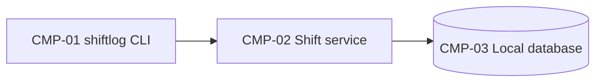

# ARCH-001 — shiftlog architecture

A command-line tool that records work shifts and reports weekly hours. This file is part of the
`context-cli-service-rdbms` example: one component of each kind the example's context documents cover.

## 1. Components



```yaml items
components:
  - id: CMP-01
    status: active
    name: "shiftlog CLI"
    kinds:
      - "user-interface"
    responsibility: "Commands to start, stop and list shifts, and the weekly report; formats all output"
    owns_data: []
    interacts_with:
      - "CMP-02"
    deployment: "The shiftlog Python package, installed with pipx"
    upstream:
      - {id: PRD-001, item: FR-001, relation: informed_by, version: 1, hash: null}
  - id: CMP-02
    status: active
    name: "Shift service"
    kinds:
      - "service"
    responsibility: "Shift rules: no overlapping shifts, rounding to the minute, weekly totals"
    owns_data:
      - "Shifts"
    interacts_with:
      - "CMP-03"
    deployment: "The shiftlog Python package, installed with pipx"
    upstream:
      - {id: PRD-001, item: FR-002, relation: informed_by, version: 1, hash: null}
  - id: CMP-03
    status: active
    name: "Local database"
    kinds:
      - "relational-store"
    responsibility: "Stores shifts in a SQLite file in the user's data folder"
    owns_data:
      - "The shifts table"
    interacts_with: []
    deployment: "SQLite file under the user's data folder"
    upstream:
      - {id: PRD-001, item: NFR-001, relation: informed_by, version: 1, hash: null}
```

## 2. Architectural questions

```yaml items
decisions:
  - id: DEC-01
    status: active
    question: "Which language and runtime does shiftlog use?"
    blocking: true
    state: resolved
    resolved_by: [ADR-001]
    notes: null
    upstream:
      - {id: PRD-001, item: FR-001, relation: informed_by, version: 1, hash: null}
  - id: DEC-02
    status: active
    question: "Which storage engine keeps shift records?"
    blocking: true
    state: resolved
    resolved_by: [ADR-002]
    notes: null
    upstream:
      - {id: PRD-001, item: NFR-001, relation: informed_by, version: 1, hash: null}
```

## 3. Evidence

```yaml items
evidence:
  - id: EVD-01
    status: active
    source: "PRD-001"
    kind: prd
    finding: "Version 1, status approved: shift recording (FR-001), weekly totals (FR-002), data kept locally (NFR-001)."
    classification: context
  - id: EVD-02
    status: active
    source: "ADR-001"
    kind: adr
    finding: "Version 1, status accepted: Python 3.12 for every component."
    classification: decided
  - id: EVD-03
    status: active
    source: "ADR-002"
    kind: adr
    finding: "Version 1, status accepted: SQLite 3 in a local file."
    classification: decided
```

## Change Log

| Version | Date | Author | Change | Items affected |
|---|---|---|---|---|
| 1 | 2026-09-29 | claude-code (session 00000000-0000-0000-0000-000000000000) | Initial draft for PRD-001 v1. Policy resolution: interview.max_calls=8 (default); architecture.mandated_platforms=none (default); quality.required_categories=floor only (default) | all |
| 1 | 2026-09-29 | Example Owner | Approved | — |
