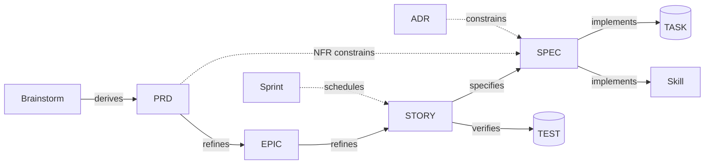

# Spec-Driven Development Templates

> **Staging.** These templates are framework source, kept here until the skill that produces each
> document is built. At that point the template moves into that skill's `assets/`. Documents made from
> them are written under `docs/specs/` in the project.

Templates for the planning chain **Brainstorm → PRD → Epic → Story → Specification**,
with **Sprint** as a scheduling overlay and **ADR** for design decisions.
Every template conforms to the conventions in this file and to the JSON Schemas in
[`src/schemas/`](../../schemas/).

| Template | Answers | Acceptance content |
|---|---|---|
| [brainstorm.md](../../claude/DevForgeAI/skills/brainstorm/assets/brainstorm.md) | What could we build, and why? | None (only candidate success signals) |
| [prd.md](../../claude/DevForgeAI/skills/prd/assets/prd.md) | What are we building, for whom, and how do we measure success? | Success metrics (`SM-`), not testable AC |
| [epic.md](epic.md) | What large slice of value are we delivering? | "Done when" criteria (`DW-`) spanning stories |
| [sprint.md](sprint.md) | What are we doing in this time-box? | None (references story AC and the sprint goal) |
| [story.md](story.md) | What exact behavior do we build next? | **Testable Given/When/Then AC (`AC-`)** |
| [spec.md](spec.md) | How exactly will it be built and verified? | Verification obligations (`VER-`) that cover each AC |
| [adr.md](../../claude/DevForgeAI/skills/architecture/assets/adr.md) | Why did we choose this design? | None (records a decision) |
| [arch.md](../../claude/DevForgeAI/skills/architecture/assets/arch.md) | How do the pieces fit, and which shared architectural questions are settled? | None; readiness per architectural question (`DEC-`) |
| [policy.md](policy.md) | Which organizational rules and preferences apply? | None; settings consumed by workflows (ADR-003) |
| [skill/](skill/) | How does an AI agent carry out a workflow? | None; eval cases verify the spec's VER items |

Arrows show the direction of refinement (upstream → downstream). `upstream`
records point the opposite way: each child names its parent.



---

## 1. Document format

Each artifact is **one Markdown file** with four kinds of content:

| Content | Format | Read by |
|---|---|---|
| Frontmatter | YAML between `---` lines | Checker, AI, people |
| **Item blocks**: citable records (requirements, AC, …) | Fenced ```` ```yaml items ```` blocks | Checker, AI, people |
| Contracts | ```` ```yaml openapi ```` and ```` ```sql ```` blocks | Standard tools (OpenAPI validators, DB) |
| Narrative: context, goals, rationale, UX, retro | Markdown prose | People, AI |

Anything a link can point at is an item block. Anything that needs judgment or nuance is prose.

### 1.1 Item-block rules

- The info string is exactly `yaml items`. The checker reads only these fences (plus
  frontmatter), so plain ```` ```yaml ```` examples like the ones in this README are ignored.
- Each fence has **exactly one top-level key**, from the collection list in 1.2.
  A collection may be split over several fences; the checker concatenates them.
- Inside a fence use `#` comments only. `<!-- -->` author notes go outside fences.
- **Quote every free-text value** (`"…"`). Unquoted text that starts with `>`, `|`, `*`, `&`,
  `!`, `@`, `%` or a backtick, or contains `: ` or ` #`, silently changes meaning.
  Values like `no`, `yes` and `3.10` also change type when unquoted.
- For lists of prose, use block sequences (`- "…"`), never flow lists (`[a, b]`),
  since a comma in the text splits the item.
- Items are never deleted or renumbered. To retire one, set `status: deprecated` and,
  if replaced, `superseded_by: FR-011`.

### 1.2 Collections

| Document | Collection key | Item ID | Fields (besides the common `id`, `status`, `superseded_by`, `upstream`) |
|---|---|---|---|
| brainstorm | `problems` | `PRB-NN` | `statement`, `who`, `evidence`, `severity` |
| brainstorm | `ideas` | `IDEA-NN` | `idea`, `addresses`, `value`, `effort`, `risk`, `score`, `disposition`, `reason` |
| brainstorm, prd | `assumptions` | `ASM-NN` | `statement`, `validation`, `state` |
| prd | `success_metrics` | `SM-NN` | `metric`, `baseline`, `target`, `measured_by` |
| prd | `functional_requirements` | `FR-NNN` | `statement`, `priority`, `release`, `notes` |
| prd | `non_functional_requirements` | `NFR-NNN` | `category`, `statement`, `priority`, `release` |
| epic | `done_when` | `DW-NN` | `criterion`, `evidence_method` |
| story | `acceptance_criteria` | `AC-NN` | `name`, `given`, `when`, `then` |
| spec | `behaviors` | `BEH-NN` | `rule` |
| spec | `errors` | `ERR-NN` | `condition`, `handling`, `user_result` |
| spec | `quality_responses` | `QR-NN` | `response`, `measured_by` |
| spec | `verifications` | `VER-NN` | `obligation`, `level`, `covers` |
| arch | `components` | `CMP-NN` | `name`, `responsibility`, `owns_data`, `interacts_with`, `deployment` |
| arch | `decisions` | `DEC-NN` | `question`, `blocking`, `state`, `resolved_by`, `notes` (upstream: affected requirements) |
| arch | `evidence` | `EVD-NN` | `source`, `kind`, `finding`, `classification` |
| policy | `settings` | `SET-NN` | `key`, `class`, `value`, `applies_when`, `overridable_by`, `rationale` |
| sprint | `scope_changes` | (none) | `date`, `change`, `story`, `reason`, `approved_by` |
| sprint | `review` | (none) | `story`, `outcome`, `evidence` |

Contract items live in standard formats and are identified in place:

| Item | Format | How the ID is marked |
|---|---|---|
| `DM-NN` data model | ```` ```sql ```` DDL (or JSON Schema for non-relational stores) | a `-- DM-NN` comment line above the table or column |
| `IF-NN` interface | ```` ```yaml openapi ```` (OpenAPI 3.1), or AsyncAPI for events | `x-item-id: IF-NN` on the operation |

---

## 2. Provenance conventions

### 2.1 Identifiers

IDs are **flat, stable, and never reused**. An ID never encodes its parent
(no `EPIC-01-US-003`), so a story can move between epics without being renamed.

| Prefix | Artifact | File name | Status |
|---|---|---|---|
| `BRN-NNN` | Brainstorm | `brainstorm/BRN-NNN.md` | templated |
| `PRD-NNN` | Product Requirements Document | `prd/PRD-NNN.md` | templated |
| `EPIC-NNN` | Epic | `epic/EPIC-NNN.md` | templated |
| `SPR-NNN` | Sprint | `sprint/SPR-NNN.md` | templated |
| `STORY-NNN` | Story | `story/STORY-NNN.md` | templated |
| `SPEC-NNN` | Specification | `spec/SPEC-NNN.md` | templated |
| `ADR-NNN` | Architecture Decision Record | `adr/ADR-NNN.md` | templated |
| `ARCH-NNN` | Architecture description (components, architectural questions, evidence; SPEC-003) | `arch/ARCH-NNN.md` | templated |
| `POL-NNN` | Policy (organizational or project settings, configuration contract v1, ADR-003) | `policy/POL-NNN.md` | templated |
| `SKL-NNN` | Skill (Agent Skills / Claude Code) | `<plugin>/skills/<skill-name>/` | templated |
| `TASK-NNN` | Implementation task | reserved | not yet templated |
| `TEST-NNN` | Test case / verification record | reserved | not yet templated |

Paths are relative to `docs/specs/`. Every document is named by its ID only, in a singular folder named for its type, with the topic kept in the document's `title`. The skill that writes a document allocates the next free number and never takes a file name. ID-only names turn a duplicate number from two parallel branches into a git conflict at merge, instead of two files that both merge silently.

Item IDs are listed in 1.2. They are unique within their document.

**Qualified reference** (in prose, commits, tests): `<DOC-ID>#<ITEM-ID>`, e.g. `PRD-001#FR-004`.

### 2.2 Common frontmatter

Every template begins with this block. Key names are identical in every file.
Type-specific keys follow the `# --- <type>-specific ---` comment.

```yaml
id: STORY-000
type: story            # brainstorm | prd | epic | sprint | story | spec | adr
title: ""
status: draft          # lifecycle per type; see 2.5
version: 1             # integer; bump on any change to a citable item
created: YYYY-MM-DD
updated: YYYY-MM-DD
owner: ""              # accountable human
authors: []            # humans and/or tools that wrote content
generated_by:          # optional AI provenance; delete when fully human-written
  tool: ""             # e.g. claude-code
  model: ""            # e.g. claude-opus-5-5
  session: ""          # session / run id, if retainable
reviewed_by: []        # humans who reviewed AI-generated content
approved_by: ""
approved_on: null
upstream: []           # document-level links, see 2.3
supersedes: []         # IDs this document replaces
superseded_by: null    # set when replaced; document becomes read-only
blocked_by: []         # IDs of documents/items that must resolve first; non-empty means not ready
```

### 2.3 Link records

A link is a record, not a bare ID:

```yaml
upstream:
  - id: PRD-001        # upstream document (required)
    item: FR-004       # upstream item; omit to link the whole document
    relation: satisfies  # vocabulary in 2.4 (required)
    version: 3         # upstream document version when the link was last reviewed (required)
    hash: null         # TOOLING ONLY; authors and AI agents always leave null (see 2.6)
    note: "optional short explanation, e.g. 'partial: web only'"
```

**A link lives in exactly one place:**

- **On an item** (`upstream:` inside an item record) when that item owns the link.
  For example, an AC satisfies an FR, or an FR derives from an idea.
- **In frontmatter** when the whole document owns the link. For example, a story refines
  its epic, a spec specifies a story, or a spec is constrained by an NFR or ADR.
  A frontmatter link may still cite an item.

Links are never repeated in prose or tables. When prose needs to mention an item, it uses
the qualified reference as plain text, and the link record stays the only source.

**Direction rule:** links point upstream only. Parents never hold lists of their children;
downstream views (a PRD's epics, a story's specs and tests, a traceability matrix) are
*generated* by scanning `upstream`, commits and test names. They are marked `GENERATED`.

**Parentage** is the `derives`, `refines` and `specifies` links. Every other relation is a trace.

### 2.4 Relation vocabulary

| Relation | Typical owner → target | Meaning |
|---|---|---|
| `derives` | PRD item → BRN item | Extracted from a brainstorm problem, idea or assumption |
| `refines` | EPIC → PRD item, STORY → EPIC | Narrows scope into a smaller deliverable |
| `satisfies` | AC → FR/NFR/DW, QR → NFR | Demonstrates or meets that requirement |
| `specifies` | SPEC → STORY | Defines how the story's AC will be met |
| `constrains` | SPEC → NFR, SPEC → ADR, PRD → another PRD's NFR, PRD → accepted ADR, PRD → POL setting (mandated platform) | The document must obey this constraint or decision. A PRD cites a shared constraint from its authoritative PRD rather than copying it |
| `implements` | SKL → SPEC, TASK/commit → SPEC item | Realizes this specification or design element |
| `verifies` | VER → AC, TEST → AC/VER | Planned or actual evidence for this criterion |
| `supersedes` | any → same type | Replaces an earlier document or item |
| `informed_by` | any → any | Context, including the policy settings a workflow applied (`{id: POL-NNN, item: SET-NN, relation: informed_by, version: N}`) |

Sprint membership is **not** a link. The sprint's `stories:` list is the only record of
which stories are in a sprint, and stories carry no `sprint:` field.

### 2.5 Status lifecycles

| Type | Document lifecycle |
|---|---|
| brainstorm | `draft → converged → archived` |
| prd, epic, spec | `draft → in-review → approved → superseded / deprecated` |
| story | `draft → ready → in-progress → in-review → done` (also `blocked`, `cancelled`) |
| sprint | `planned → active → closed` |
| adr | `proposed → accepted → superseded / deprecated / rejected` |
| *items* | `active → deprecated` |

Once `approved` (or `accepted`), material changes require a `version` bump plus a
Change Log entry. For ADRs, write a new ADR that `supersedes` the old one.

### 2.6 Suspect links and `hash`

A link is **suspect**, and its owner must be re-reviewed, when:

- the upstream **item's** current hash differs from the link's `hash`, or
- `hash` is null and the upstream **document's** `version` is higher than the link's `version`.

After review, the checker rewrites `version` and `hash` on the link.

**Hash definition:** the first 8 lowercase hex characters of SHA-256 over the item's
**canonical JSON**, which is:

1. the item record as parsed from YAML, **without its `upstream` field**;
2. dates converted to ISO `YYYY-MM-DD` strings;
3. serialized with sorted keys, no insignificant whitespace, UTF-8.

`upstream` is excluded so that re-reviewing an FR's own link to its idea does not flag every
epic and story below the FR. `status` is included, so deprecating an item flags its children.

Only the checker writes `hash`. A hash typed by a person or model is recomputed on review. The
design fails safe: a wrong hash can only cause a false suspect flag, never hide a change.
Always quote hashes (`hash: "0912ab3c"`). Unquoted, an all-digit hash parses as a number
and in YAML 1.2 parsers (js-yaml, ruamel) `0e123456` parses as `0.0`. The schema rejects any hash that doesn't *parse* as an 8-hex string. It never sees quotes, so quoting is the author's job.

Until the checker exists, only the document-version rule applies, so editing one FR flags
every child of that PRD. Item hashes remove this over-flagging.

### 2.7 Unknowns

Never guess. Mark unknowns inline as `[NEEDS CLARIFICATION: <question>]`, in prose or inside a
quoted item value. The marker itself is the record: resolving it means replacing it with the answer.
A document may not move to `approved` or `ready` while any marker remains.

A second marker, `[NEEDS ADR: <decision>; affects FR-NNN, FR-NNN]`, records an architecture decision that
is still open (no accepted ADR). It does **not** block approving the PRD, because design may be deferred,
but it **does** block writing epics for the requirements it names until an accepted ADR resolves it.

`<!-- ... -->` comments are instructions for the author. Delete them when you fill in the template.

### 2.8 Code and test linkage

- Commits and PRs reference the story and spec items they implement: `STORY-012 SPEC-007#IF-01`.
- Test names or annotations carry the AC or VER they verify:
  `test_STORY_012_AC_01_link_email_sent`, or a Gherkin tag `@STORY-012 @AC-01`.
- From these, tooling generates the full trace IDEA → FR → EPIC → STORY/AC → SPEC → code → TEST.

---

## 3. Worked example thread

```
BRN-001#IDEA-03   "Passwordless login via email magic link"
   └─derives──> PRD-001#FR-004        "Users can sign in without a password"
                PRD-001#NFR-002       "Auth endpoints p95 < 300 ms"
      └─refines──> EPIC-002           "Passwordless Authentication"
                   EPIC-002#DW-01     "A new user can register and sign in with no password"
         └─refines──> STORY-012       "Request a magic link"
                      STORY-012#AC-01 satisfies PRD-001#FR-004 and EPIC-002#DW-01
            └─specifies──> SPEC-007   "Magic-link issuance" (constrained by PRD-001#NFR-002, ADR-003)
                           SPEC-007#VER-01 verifies STORY-012#AC-01, covers IF-01, DM-01, BEH-01
               └─implements──> commit "STORY-012 SPEC-007#IF-01 add magic-link endpoint"
               └─verifies────> test_STORY_012_AC_01_link_email_sent
SPR-004.stories: [STORY-012, STORY-013]   (schedules; not a link)
```

`STORY-012`, frontmatter link (the whole story refines the epic):

```yaml
upstream:
  - {id: EPIC-002, relation: refines, version: 2, hash: null}
```

`STORY-012`, item block (the AC owns its own links):

```yaml
acceptance_criteria:
  - id: AC-01
    status: active
    name: "Magic link email is sent"
    given:
      - "a registered email address"
    when:
      - "I request a sign-in link"
    then:
      - "an email containing a single-use link arrives within 60 s"
      - "the link expires after 15 minutes"
    upstream:
      - {id: PRD-001,  item: FR-004, relation: satisfies, version: 3, hash: "9f2c1a7e"}
      - {id: EPIC-002, item: DW-01,  relation: satisfies, version: 2, hash: null}
```

`SPEC-007`, item block (verification planned against the AC):

```yaml
verifications:
  - id: VER-01
    status: active
    obligation: "Requesting a link for a registered email sends exactly one email containing a valid token"
    level: integration
    covers:
      - IF-01
      - DM-01
      - BEH-01
    upstream:
      - {id: STORY-012, item: AC-01, relation: verifies, version: 1, hash: null}
```

---

## 4. Validation

"The checker" throughout these templates is `devforgeai check`, a subcommand of the
framework's Rust CLI, `devforgeai`.

`src/schemas/` contains one JSON Schema (draft 2020-12) per document type plus
`common.schema.json` (ID patterns, dates, hash, relation vocabulary, link record).
The shared frontmatter and item keys are copied into each type schema, so a change to them
must be made in every type schema. No schema generator exists in the repository yet: edit the
JSON by hand, and validate a document of each affected type afterwards. A checker extracts each document into:

```json
{ "frontmatter": { ... }, "<collection>": [ ... ], "...": [ ... ] }
```

Frontmatter delimiters are whole `---` lines. Don't split on the substring `---`, because
the `# --- <type>-specific ---` comment contains it. The checker converts YAML dates to ISO strings and validates the result against `<type>.schema.json`.
Unknown keys are errors (`additionalProperties: false`), so a typo such as `relaton:` fails.
OpenAPI and SQL blocks are validated by their own tools, not by these schemas.
