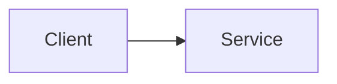

# SPEC-000 — <title>

<!-- The story says WHAT behavior is required and how it will be accepted.
     The spec says HOW that behavior will be built, in enough detail that a developer
     or AI agent can implement and verify it without guessing.
     Every AC of every story this spec specifies must be verified by a VER item (section 9). -->

## 1. Overview

<!-- One paragraph: the approach, and why it was chosen over alternatives
     (write an ADR if the choice is significant). -->

## 2. Constraints

<!-- Prose: how the frontmatter `constrains` links (NFRs, ADRs) shape this design. -->

## 3. Architecture and components



<!-- Responsibilities of each component touched. -->

## 4. Data model

<!-- DDL is the contract. Put a `-- DM-NN` line above each table or significant column.
     For non-relational stores, replace this block with a ```json JSON Schema block
     whose objects carry "x-item-id": "DM-NN". -->

```sql
-- DM-01
CREATE TABLE example (
    id          UUID PRIMARY KEY,
    created_at  TIMESTAMPTZ NOT NULL DEFAULT now()
);
```

## 5. Interfaces and contracts

<!-- A minimal, valid OpenAPI 3.1 document. Mark each operation with x-item-id: IF-NN.
     For event interfaces use an AsyncAPI block. For large APIs, move the contract to
     contracts/<name>.openapi.yaml and leave a link here. -->

```yaml openapi
openapi: 3.1.0
info:
  title: "<service>"
  version: "0.1.0"
paths:
  /example:
    post:
      x-item-id: IF-01
      operationId: createExample
      summary: "<what it does>"
      requestBody:
        required: true
        content:
          application/json:
            schema:
              type: object
              required: [name]
              properties:
                name: {type: string}
      responses:
        "201":
          description: "Created"
        "400":
          description: "Invalid request (see ERR-01)"
```

## 6. Behavior

```yaml items
behaviors:
  - id: BEH-01
    status: active
    rule: "<business rule, algorithm step or state transition>"
```

## 7. Errors and edge cases

```yaml items
errors:
  - id: ERR-01
    status: active
    condition: "<condition>"
    handling: "<what the system does>"
    user_result: "<message or status the user sees>"
```

## 8. Non-functional design

<!-- How each constraining NFR is met: performance budget, security controls,
     observability, accessibility, privacy. One QR item per NFR, and each must satisfy it. -->

```yaml items
quality_responses:
  - id: QR-01
    status: active
    response: "<caching, indexing, rate limit…>"
    measured_by: "<load test or metric>"
    upstream:
      - {id: PRD-000, item: NFR-001, relation: satisfies, version: 1, hash: null}
```

## 9. Verification

<!-- One or more VER items per story AC. `covers` lists the design items the test exercises.
     A story AC with no VER, or a design item no VER covers, is a gap the checker reports.
     Test names are GENERATED from tests that cite SPEC-000#VER-NN. -->

```yaml items
verifications:
  - id: VER-01
    status: active
    obligation: "<what must be demonstrated>"
    level: integration        # unit | integration | e2e | performance | security | manual
    covers:
      - DM-01
      - IF-01
      - BEH-01
    upstream:
      - {id: STORY-000, item: AC-01, relation: verifies, version: 1, hash: null}
```

## 10. Rollout, migration and rollback

<!-- Feature flags, data migration steps, backward compatibility, rollback plan. -->

## 11. Implementation plan

<!-- Ordered steps, each naming the spec items it implements. These become TASK
     documents if a tasks template is adopted. -->

1. <step> (implements DM-01)
2. <step> (implements IF-01)

## 12. Alternatives considered

<!-- Prose: option, pros, cons, why not chosen. Significant choices get an ADR. -->

## 13. Open questions

- [NEEDS CLARIFICATION: <question>]

## Change Log

| Version | Date | Author | Change | Items affected |
|---|---|---|---|---|
| 1 | YYYY-MM-DD | | Initial draft | all |
